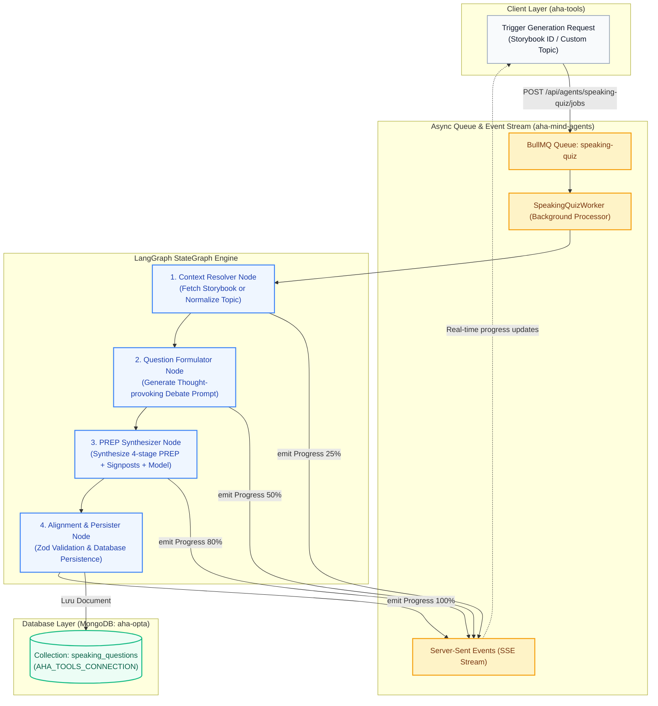
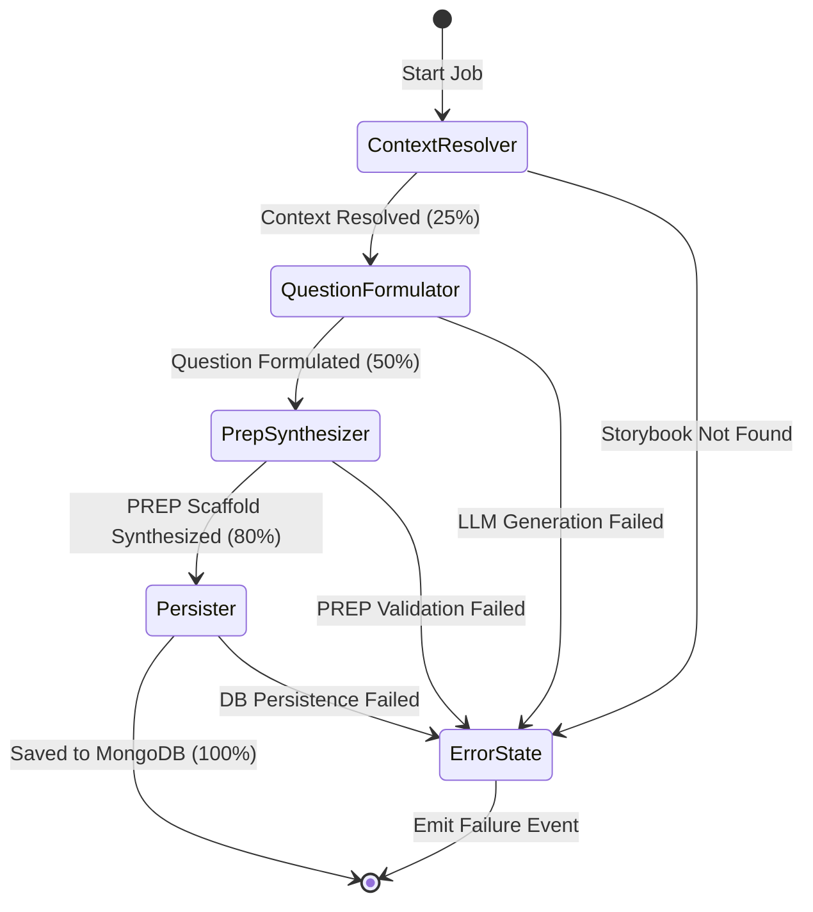

# Design Specification: Speaking Quiz Generation Module (`aha-mind-agents`)

> **Document Metadata:**
> - **Module ID:** `MOD-AGENT-SPEAKING-QUIZ`
> - **System:** `aha-mind-agents` (Decoupled Autonomous Multi-Agent Management & Orchestration Backend)
> - **Client Consumer:** `aha-tools` (Next.js Frontend & Learning Platform)
> - **Author:** Anh Tú (IT Lecturer & Technical Writer)
> - **Date:** 2026-09-30
> - **Status:** DRAFT - PENDING APPROVAL
> - **Target Framework:** NestJS 11, LangGraph v0.2, Google GenAI (Gemini 2.5/1.5 Flash), BullMQ v11, MongoDB (Mongoose v11)

---

## 1. Giải Phẫu Khái Niệm: Speaking Quiz Generation Engine (Definition Anatomy)

> **Định nghĩa chuẩn học thuật (Academic Definition):**  
> **Speaking Quiz Generation Engine** là một hệ thống tác nhân đa tầng (Multi-Stage Autonomous Agent System) hoạt động theo cơ chế bất đồng bộ dựa trên hàng đợi (Queue-driven Asynchronous Architecture). Hệ thống có nhiệm vụ chuyển hóa ngữ cảnh nội dung bài học (Storybook Context) hoặc chủ đề tự do (Custom Theme) thành các bài tập diễn ngôn ngắn chuẩn sư phạm theo cấu trúc **PREP** (Point, Reason, Example, Point), ràng buộc việc tái sử dụng từ vựng đích (Target Keywords) và tự động kiến tạo giàn giáo ngôn ngữ (Scaffolding Signposts & Model Answers).



### Giải phẫu các thành phần cốt lõi:
1. **Multi-Stage Autonomous Agent (Tác nhân đa tầng tự trị):** Hệ thống không dùng 1 prompt duy nhất để sinh toàn bộ dữ liệu (tránh rủi ro hallucinations và giảm chất lượng lập luận), mà phân tách bài toán thành chuỗi các nodes chuyên trách nối tiếp nhau qua LangGraph StateGraph.
2. **Context-to-Discourse Transformation (Chuyển hóa ngữ cảnh thành diễn ngôn):** Khả năng phân tích cốt truyện (Storybook sentences & vocabulary) để tìm ra "hạt mầm tranh luận" (Debatable Seed), biến nội dung tiếp nhận thụ động (Input Reading/Listening) thành chủ đề sản sinh chủ động (Output Speaking).
3. **PREP Scaffolding Constrained Synthesis (Tổng hợp có ràng buộc giàn giáo PREP):** Ràng buộc LLM phải xây dựng câu mẫu và từ nối signposts khớp chính xác theo 4 chặng $P \to R \to E \to P$, đồng thời bắt buộc lồng ghép các từ vựng FSRS mục tiêu vào câu mẫu.

---

## 2. Bối Cảnh Hệ Thống & Phân Định Trách Nhiệm (System Context)

### 2.1. Phân định ranh giới giữa `aha-tools` và `aha-mind-agents`

| Tiêu chí | `aha-tools` (Frontend & App Layer) | `aha-mind-agents` (Backend & AI Orchestration) |
| :--- | :--- | :--- |
| **Công nghệ** | Next.js 16 (App Router), React 19, TypeScript | NestJS 11, LangGraph, BullMQ, Redis, Google GenAI |
| **Vai trò** | Trải nghiệm người dùng (UI), hiển thị giàn giáo PREP, phát âm Web Speech API, trigger lệnh sinh câu hỏi. | Tính toán AI nặng (Compute-heavy), điều phối đa tác nhân, xếp hàng job, lưu trữ dữ liệu tập trung. |
| **Giao tiếp** | Gọi REST API kích hoạt job, lắng nghe tiến trình qua SSE, đọc dữ liệu câu hỏi từ MongoDB. | Cung cấp endpoints nhận job, phát SSE events, trực tiếp ghi dữ liệu vào collection `speaking_questions`. |

### 2.2. Phân tích nguyên nhân kiến trúc (Root Cause Analysis)
- **Vấn đề của việc chạy trực tiếp trên Next.js API Routes:** Quá trình sinh đề nói PREP hoàn chỉnh qua LLM đòi hỏi xử lý tuần tự (Context Resolution $\to$ Question Generation $\to$ PREP Scaffolding Synthesis $\to$ Keyword Verification). Quá trình này tiêu tốn từ 6 đến 12 giây. Khi giáo viên hoặc học viên yêu cầu đồng bộ hàng loạt (Batch Sync) 5 bài học, Next.js serverless functions sẽ vượt ngưỡng timeout của Vercel (10s–15s), gây crash và nghẽn hệ thống.
- **Giải pháp:** Chuyển toàn bộ tải tính toán sang `aha-mind-agents` với hạ tầng **NestJS + BullMQ Worker + Redis**. Client gửi request nhận ngay HTTP `202 Accepted` kèm `jobId`, sau đó theo dõi thanh tiến trình qua Server-Sent Events (SSE).

---

## 3. Mô Hình Dữ Liệu & Schema Database (Domain Model)

Dữ liệu được lưu trữ trực tiếp vào MongoDB `aha-opta` thông qua connection `AHA_TOOLS_CONNECTION` để đảm bảo `aha-tools` có thể truy vấn ngay lập tức mà không cần đồng bộ qua REST.

### 3.1. File: `src/infra/database/schemas/speaking-question.schema.ts`

```typescript
/**
 * @file speaking-question.schema.ts
 * @description Mongoose Schema cho collection `speaking_questions` trong aha-mind-agents
 *
 * Made by Anh Tu - Share to be share
 */

import { Prop, Schema, SchemaFactory } from '@nestjs/mongoose';
import { Document, Schema as MongooseSchema } from 'mongoose';

@Schema({ _id: false })
export class TargetKeywordItem {
  @Prop({ required: true })
  word: string;

  @Prop()
  ipa?: string;

  @Prop({ required: true })
  meaning: string;
}

export const TargetKeywordItemSchema = SchemaFactory.createForClass(TargetKeywordItem);

@Schema({ _id: false })
export class SpeakingScaffoldStageItem {
  @Prop({ required: true, enum: ['point', 'reason', 'example', 'conclusion'] })
  stage: string;

  @Prop({ required: true })
  title: string; // "Point", "Reason", "Example", "Point"

  @Prop({ type: [String], required: true })
  signposts: string[];

  @Prop({ required: true })
  hint: string;

  @Prop({ required: true })
  modelAnswer: string;
}

export const SpeakingScaffoldStageItemSchema = SchemaFactory.createForClass(SpeakingScaffoldStageItem);

@Schema({ _id: false })
export class SpeakingPrepScaffold {
  @Prop({ type: SpeakingScaffoldStageItemSchema, required: true })
  point: SpeakingScaffoldStageItem;

  @Prop({ type: SpeakingScaffoldStageItemSchema, required: true })
  reason: SpeakingScaffoldStageItem;

  @Prop({ type: SpeakingScaffoldStageItemSchema, required: true })
  example: SpeakingScaffoldStageItem;

  @Prop({ type: SpeakingScaffoldStageItemSchema, required: true })
  conclusion: SpeakingScaffoldStageItem;
}

export const SpeakingPrepScaffoldSchema = SchemaFactory.createForClass(SpeakingPrepScaffold);

@Schema({ timestamps: true, collection: 'speaking_questions' })
export class SpeakingQuestion extends Document {
  @Prop({ type: MongooseSchema.Types.ObjectId, ref: 'Storybook', required: false, index: true })
  storybookId?: MongooseSchema.Types.ObjectId;

  @Prop({ required: true, index: true })
  topic: string;

  @Prop({ required: true })
  question: string;

  @Prop({ required: true, enum: ['B1', 'B2', 'C1'], default: 'B2', index: true })
  level: string;

  @Prop({ type: [TargetKeywordItemSchema], default: [] })
  targetKeywords: TargetKeywordItem[];

  @Prop({ type: SpeakingPrepScaffoldSchema, required: true })
  prepScaffold: SpeakingPrepScaffold;

  @Prop({ required: true, enum: ['active', 'archived'], default: 'active', index: true })
  status: string;

  @Prop({ required: false })
  generatedByModel?: string; // e.g. "gemini-2.5-flash"
}

export const SpeakingQuestionSchema = SchemaFactory.createForClass(SpeakingQuestion);

// Index hợp nhất để tối ưu truy vấn tìm câu hỏi theo bài học
SpeakingQuestionSchema.index({ storybookId: 1, status: 1 });
SpeakingQuestionSchema.index({ level: 1, status: 1 });
```

---

## 4. Kiến Trúc Plugin & LangGraph Pipeline (`src/plugins/speaking-quiz/`)

Module được tổ chức dưới dạng một **AgentPlugin** độc lập theo kiến trúc chuẩn của `aha-mind-agents`.

### 4.1. Cấu trúc module
```text
aha-mind-agents/src/plugins/speaking-quiz/
├── speaking-quiz.module.ts            # NestJS Module đăng ký Schema, Worker & BullMQ Queue
├── speaking-quiz.plugin.ts            # Implement AgentPlugin interface
├── speaking-quiz.schema.ts            # Zod validation schemas cho inputs/outputs
├── speaking-quiz.state.ts             # Interface SpeakingQuizState cho LangGraph
├── nodes/
│   ├── context-resolver.node.ts       # Node 1: Lấy ngữ cảnh Storybook hoặc Custom Topic
│   ├── question-formulator.node.ts    # Node 2: Prompt LLM tạo câu hỏi tranh luận
│   ├── prep-synthesizer.node.ts       # Node 3: Prompt LLM tạo 4 chặng PREP giàn giáo
│   └── persister.node.ts              # Node 4: Kiểm duyệt Zod & Ghi vào MongoDB
└── pipelines/
    ├── storybook-speaking.pipeline.ts # Pipeline thực thi cho nguồn Storybook
    └── custom-topic-speaking.pipeline.ts # Pipeline thực thi cho nguồn Custom Topic
```

### 4.2. LangGraph State Definition (`speaking-quiz.state.ts`)

```typescript
export interface SpeakingQuizState {
  // Input parameters
  storybookId?: string;
  customTopic?: string;
  requestedLevel?: 'B1' | 'B2' | 'C1';
  customKeywords?: string[];

  // Resolved context
  resolvedTopic: string;
  sourceContentSummary: string;
  targetKeywords: Array<{ word: string; ipa?: string; meaning: string }>;
  level: 'B1' | 'B2' | 'C1';

  // LLM Outputs
  generatedQuestion?: string;
  prepScaffold?: {
    point: { title: string; signposts: string[]; hint: string; modelAnswer: string };
    reason: { title: string; signposts: string[]; hint: string; modelAnswer: string };
    example: { title: string; signposts: string[]; hint: string; modelAnswer: string };
    conclusion: { title: string; signposts: string[]; hint: string; modelAnswer: string };
  };

  // Execution metadata
  persistedId?: string;
  error?: string;
}
```

### 4.3. Đặc tả chi tiết các Nodes trong StateGraph



#### Node 1: `ContextResolverNode`
- **Nhiệm vụ:**
  - Nếu có `storybookId`: Truy vấn document `Storybook` trong MongoDB, trích xuất `title`, tổng hợp nội dung các câu trong `sentences`, và chọn lọc 2–3 từ vựng tiêu biểu từ `keywords` làm `targetKeywords`.
  - Nếu là `customTopic`: Chuẩn hóa chủ đề, gán level mặc định (B2 nếu không chỉ định). Nếu có `customKeywords`, tra cứu phiên âm IPA và định nghĩa tiếng Anh qua LLM/Lexicon service.
- **Tiến trình phát ra:** `25%` - *"Context resolved successfully"*.

#### Node 2: `QuestionFormulatorNode`
- **Nhiệm vụ:**
  - Gọi LLM (Gemini 2.5 Flash) với system prompt sư phạm nghiêm ngặt.
  - Phân tích ngữ cảnh để tạo ra một câu hỏi **mang tính kích thích quan điểm cá nhân (Thought-provoking opinion question)**.
  - Ràng buộc: Câu hỏi KHÔNG được là dạng đọc hiểu máy móc (Fact-based retrieval), mà phải là một tình huống đạo đức, quan điểm xã hội hoặc phát triển cá nhân mở ra 2 luồng quan điểm đối lập.
- **Tiến trình phát ra:** `50%` - *"Debate question formulated"*.

#### Node 3: `PrepSynthesizerNode`
- **Nhiệm vụ:**
  - Gọi LLM với Structured Output (Zod Schema) để sinh 4 chặng:
    1. **Point**: Gợi ý cách mở đầu lập trường + 3 từ nối (Signposts) + 1 câu mẫu ngắn gọn.
    2. **Reason**: Gợi ý giải thích nguyên nhân cốt lõi + 3 từ nối + 1 câu mẫu có chứa từ vựng mục tiêu.
    3. **Example**: Gợi ý tình huống minh chứng thực tế + 3 từ nối + 1 câu mẫu sinh động.
    4. **Point**: Gợi ý đúc kết thông điệp + 3 từ nối + 1 câu khẳng định lại.
  - Kiểm tra tính gắn kết: Đảm bảo ít nhất 2 từ vựng trong `targetKeywords` được lồng ghép tự nhiên vào các câu mẫu.
- **Tiến trình phát ra:** `80%` - *"PREP scaffold synthesized"*.

#### Node 4: `PersisterNode`
- **Nhiệm vụ:**
  - Thẩm định lại toàn bộ schema dữ liệu bằng Zod `SpeakingQuestionOutputSchema`.
  - Khởi tạo document mới và ghi vào collection `speaking_questions`.
  - Đóng gói ID bản ghi vừa tạo vào `persistedId`.
- **Tiến trình phát ra:** `100%` - *"Speaking quiz successfully created and saved"*.

---

## 5. Kiến Trúc Hàng Đợi Bất Đồng Bộ & Server-Sent Events (BullMQ & SSE)

### 5.1. Queue Configuration
- **Tên Queue:** `speaking-quiz-queue`
- **Job Name:** `generate-speaking-quiz`
- **Cấu hình Retry:**
  - `attempts: 3`
  - `backoff: { type: 'exponential', delay: 2000 }`
  - `removeOnComplete: 100`
  - `removeOnFail: 50`

### 5.2. Định dạng sự kiện tiến trình (SSE Event Format)
Client lắng nghe endpoint SSE `/api/agents/speaking-quiz/jobs/:jobId/progress` sẽ nhận được chuỗi sự kiện có cấu trúc:

```json
{
  "jobId": "job-sq-67a8b9c0",
  "progress": 50,
  "stage": "question_formulated",
  "message": "Generated debate question: 'Should AI be allowed to replace human teachers?'",
  "timestamp": "2026-09-30T16:40:00.000Z"
}
```

Khi hoàn thành (100%):
```json
{
  "jobId": "job-sq-67a8b9c0",
  "progress": 100,
  "stage": "completed",
  "message": "Speaking quiz successfully created and saved",
  "result": {
    "questionId": "67a8b9c0f123456789abcdef",
    "topic": "Technology & Education",
    "question": "Should AI be allowed to replace human teachers?",
    "level": "B2"
  },
  "timestamp": "2026-09-30T16:40:08.000Z"
}
```

---

## 6. Đặc Tả Giao Diện Lập Trình (API Contracts)

### 6.1. Kích hoạt Job sinh câu hỏi Speaking Quiz
- **Endpoint:** `POST /api/agents/speaking-quiz/jobs`
- **Headers:** `Content-Type: application/json`
- **Request Body (Storybook Source):**
  ```json
  {
    "storybookId": "679c1a2b3c4d5e6f7a8b9c0d",
    "level": "B2"
  }
  ```
- **Request Body (Custom Topic Source):**
  ```json
  {
    "customTopic": "Remote Work vs Office Work",
    "level": "B1",
    "targetKeywords": ["productivity", "isolation"]
  }
  ```
- **Response (HTTP 202 Accepted):**
  ```json
  {
    "jobId": "job-sq-1727712345",
    "status": "queued",
    "sseUrl": "/api/agents/speaking-quiz/jobs/job-sq-1727712345/progress",
    "createdAt": "2026-09-30T16:40:00.000Z"
  }
  ```

### 6.2. Lắng nghe tiến trình thời gian thực (SSE Stream)
- **Endpoint:** `GET /api/agents/speaking-quiz/jobs/:jobId/progress`
- **Headers:** `Accept: text/event-stream`
- **Phản hồi:** Stream dữ liệu SSE chuẩn `data: {...}\n\n`.

### 6.3. Lấy thông tin câu hỏi theo ID
- **Endpoint:** `GET /api/agents/speaking-quiz/questions/:id`
- **Response (HTTP 200 OK):** Trả về đối tượng `ISpeakingQuestion` khớp 100% với schema client [`ISpeakingQuestion`](file:///Users/anhtus/Documents/Development/NextJS/aha-tools/src/lib/types/speaking-quiz.ts).

### 6.4. Liệt kê danh sách câu hỏi theo Storybook
- **Endpoint:** `GET /api/agents/speaking-quiz/questions?storybookId=:storybookId`
- **Response (HTTP 200 OK):**
  ```json
  {
    "total": 1,
    "questions": [
      {
        "id": "67a8b9c0f123456789abcdef",
        "storybookId": "679c1a2b3c4d5e6f7a8b9c0d",
        "topic": "Technology & Education",
        "question": "Should AI be allowed to replace human teachers?",
        "level": "B2",
        "targetKeywords": [...],
        "prepScaffold": {...}
      }
    ]
  }
  ```

---

## 7. Khả Năng Chống Lỗi & Xử Lý Ngoại Lệ (Fault Tolerance & Resilience)

1. **LLM Structured Output Retry:** Nếu LLM trả về JSON thiếu một trong 4 chặng PREP hoặc format sai Zod Schema, LangGraph node sẽ tự động retry tối đa 2 lần với prompt sửa lỗi bổ sung (Self-Correction Loop).
2. **Keyword Fallback:** Nếu Storybook không có đủ 2 từ vựng chất lượng cao, `ContextResolverNode` sẽ tự động trích xuất 2 từ vựng có độ dài lớn nhất hoặc cấp độ khó cao nhất trong bài học để làm target keywords.
3. **Queue Idempotency (Tránh sinh trùng lặp):** Khi nhận request sinh câu hỏi cho một `storybookId`, kiểm tra nếu trong DB đã tồn tại câu hỏi active cho storybook đó thì trả về ngay câu hỏi sẵn có hoặc gắn cờ `forceRegenerate: true` nếu muốn tạo mới.
4. **BullMQ Dead Letter Queue:** Nếu job thất bại sau 3 lần retry, đẩy vào hàng đợi lỗi kèm stack trace để phục vụ việc debug trên Dashboard của `aha-mind-agents`.

---

## 8. Tiêu Chí Nghiệm Thu (Acceptance Criteria)

- [ ] **AC-AGENT-01:** Module `SpeakingQuizModule` được đăng ký thành công vào hệ thống plugin của `aha-mind-agents` và hiển thị trên API Documentation Swagger.
- [ ] **AC-AGENT-02:** StateGraph thực thi thành công từ đầu đến cuối trong thời gian $\le 10$ giây cho một đề bài PREP.
- [ ] **AC-AGENT-03:** Câu hỏi sinh ra đảm bảo tính kích thích tư duy (không phải câu hỏi Yes/No hay tìm thông tin thụ động), phù hợp cấp độ CEFR chỉ định.
- [ ] **AC-AGENT-04:** Dữ liệu đầu ra lưu vào collection `speaking_questions` thỏa mãn 100% interface [`ISpeakingQuestion`](file:///Users/anhtus/Documents/Development/NextJS/aha-tools/src/lib/types/speaking-quiz.ts) của `aha-tools`.
- [ ] **AC-AGENT-05:** Kênh SSE stream phát đầy đủ các mốc tiến trình `25% -> 50% -> 80% -> 100%` với thông điệp rõ ràng.

---

*Made by Anh Tu - Share to be share*
