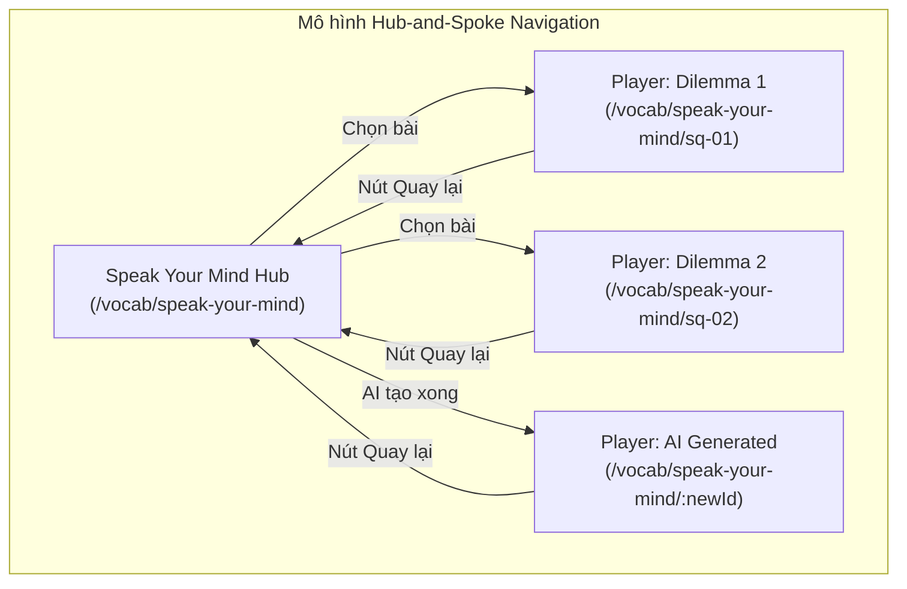
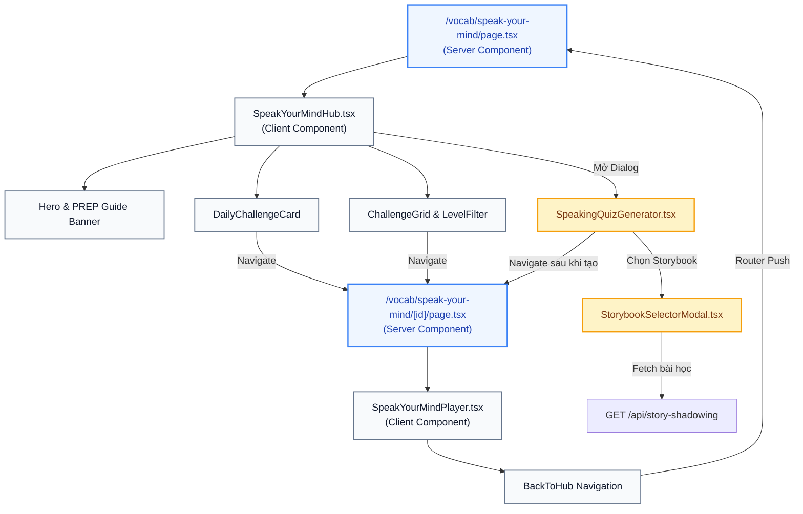

# Design Specification: Speaking Hub Architecture & Visual Storybook Picker

> **Document Metadata:**
> - **Module ID:** `MOD-VOCAB-SPEAKING-HUB`
> - **System:** `aha-tools` (Next.js 15 App Router, React 19, Tailwind CSS)
> - **Author:** Anh Tú (IT Lecturer & Technical Writer)
> - **Date:** 2026-10-01
> - **Status:** APPROVED & SPECIFIED
> - **Mapped Requirements:** `FR-VOCAB-06`, `FR-VOCAB-07`, `US-VOCAB-03`, `US-VOCAB-04`, `AC-VOCAB-11`, `AC-VOCAB-12`

---

## 1. Giải Phẫu Khái Niệm: Hub-and-Spoke Navigation & Direct Manipulation (Definition Anatomy)

> **Định nghĩa chuẩn học thuật (Academic Definition):**  
> **Hub-and-Spoke Navigation Architecture** là mô hình kiến trúc điều hướng phân cấp trong đó một trang trung tâm (**Hub**) đóng vai trò làm điểm định tuyến và tổng quan thông tin, cho phép người dùng rẽ nhánh sang các tác vụ chuyên sâu độc lập (**Spokes** / Player) và quay trở về mà không làm đứt gãy trạng thái ứng dụng.  
> **Direct Manipulation Pattern** là nguyên lý thiết kế giao diện người dùng cho phép tương tác trực tiếp với các biểu tượng thị giác đại diện cho thực thể đời thực (ảnh bài học, tiêu đề, nhãn độ khó) thay vì phải gián tiếp nhập liệu các định danh kỹ thuật trừu tượng (như Database ID).

---

## 2. Phân Tích Nguyên Nhân Gốc Rễ & Trade-off (Root Cause Analysis & Trade-offs)

### 2.1. Vấn đề 1: Trực tiếp vào chi tiết câu hỏi (UX Disorientation)
- **Root Cause:** Route `/vocab/speak-your-mind` vốn được tạo cho một thí điểm giao diện nhỏ. Khi được thăng cấp thành 1 trong 5 tab cốt lõi trên thanh `MobileTabBar`, việc mở tab ép người học giải câu hỏi mẫu `sq-01` mà không có màn hình tổng quan, không có danh mục lựa chọn hay giới thiệu phương pháp PREP khiến người dùng bị bỡ ngỡ (Disorientation).
- **Trade-off Analysis:**
  - *Phương án A (Query Params `?id=...`):* Giữ nguyên 1 file `page.tsx`, ít thay đổi file. Nhưng phá vỡ tính RESTful của Next.js App Router, URL chia sẻ kém chuẩn mực.
  - *Phương án B (Tách Route động `[id]` - Được chọn):* Tách `page.tsx` thành Hub và `[id]/page.tsx` thành Player. Tăng thêm 1 thư mục route, nhưng mang lại URL chuẩn, hỗ trợ bookmark, deep-link độc lập và tách biệt hoàn toàn trách nhiệm (Separation of Concerns).

### 2.2. Vấn đề 2: Bắt nhập thủ công ID Storybook (Leaky Abstraction)
- **Root Cause:** Backend API nhận tham số `storybookId: string`. Do chưa có UI selector, form đặt tạm ô input thô `<input placeholder="VD: 679c1a2b3c4d5e6f7a8b9c0d" />`. Đây là lỗi rò rỉ chi tiết hệ thống ra tầng người dùng (Leaky Abstraction).
- **Giải pháp:** Xây dựng `StorybookSelectorModal` gọi `GET /api/story-shadowing`, hiển thị danh sách bài học trực quan kèm tìm kiếm (Search), ảnh đại diện (Thumbnail) và cấp độ (Level). Khi chọn, hệ thống tự động gán `storybookId` vào state ngầm.

---

## 3. Kiến Trúc Chi Tiết Các Thành Phần (Component Architecture)

### 3.1. Hub Component (`SpeakYourMindHub.tsx`)
1. **Header & PREP Methodology Banner:**
   - Badge "Speak Your Mind - PREP Argumentation".
   - Tóm tắt 4 bước: **P**oint (Khẳng định quan điểm) → **R**eason (Lý giải nguyên nhân cốt lõi) → **E**xample (Minh chứng thực tế) → **P**oint (Đúc kết khẳng định).
2. **AI Generator Action:**
   - Nút nổi bật: "Tạo thử thách mới bằng AI (AI Debate Generator)".
   - Mở modal tạo bài nói.
3. **Daily Featured Challenge Card:**
   - Thẻ câu hỏi tiêu biểu trong ngày với viền Amber, badge cấp độ, danh sách từ vựng trọng tâm.
   - Nút CTA: "Luyện nói ngay".
4. **Challenge Library (Thư viện thử thách):**
   - Filter chips: `Tất cả` | `B1` | `B2` | `C1`.
   - Grid cards hiển thị danh sách câu hỏi có sẵn từ `speaking-quiz.service.ts`.

### 3.2. Player Route (`/vocab/speak-your-mind/[id]/page.tsx`)
1. **Server Loader:**
   - Gọi `getSpeakingQuestionById(id)` lấy câu hỏi.
2. **Player Improvements:**
   - Nút quay lại: `← Quay lại thư viện chủ đề` đưa về `/vocab/speak-your-mind`.
   - Giữ nguyên các chức năng ghi âm, giàn giáo PREP, phát âm giọng chuẩn bản xứ qua Web Speech API.

### 3.3. Storybook Selector (`StorybookSelectorModal.tsx`)
1. **Trạng thái chưa chọn:**
   - Nút dạng viền nét đứt: "Chọn bài học từ Storybook của bạn" kèm icon `BookOpen`.
2. **Modal danh sách:**
   - Sử dụng SWR hoặc `fetch` lấy dữ liệu từ `GET /api/story-shadowing`.
   - Search input lọc nhanh theo tiêu đề.
   - Filter chip theo cấp độ (`Tất cả`, `Easy`, `Medium`, `Hard`).
   - Danh sách bài: Thumbnail, Title, Cấp độ, Số phần (nếu là series).
3. **Trạng thái đã chọn:**
   - Thẻ tóm tắt hiển thị bài được chọn.
   - Nút "Đổi bài" (mở lại modal) và nút "Xoá".
   - Tự động gắn `storybookId = selectedStory._id` vào form.

---

*Made by Anh Tu - Share to be share*
