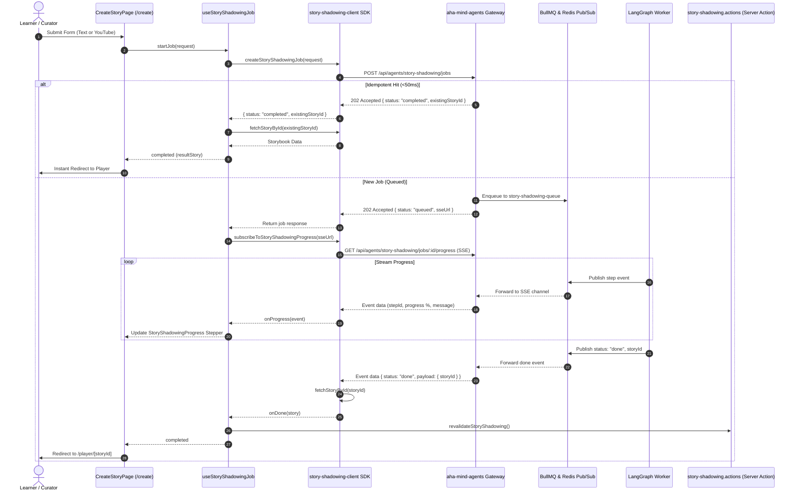

# Story Shadowing Agent API Integration Design Specification

> **Feature:** Story Shadowing Agent Integration (aha-mind-agents v2.0.0)  
> **Author:** Anh Tu  
> **Date:** 2026-10-02  
> **Status:** Approved / In Implementation  
> **Target Modules:** `src/lib/services/story-shadowing-client.ts`, `src/hooks/useStoryShadowingJob.ts`, `src/components/story-shadowing/StoryShadowingProgress.tsx`, `src/app/apps/story-shadowing/create/page.tsx`

---

## 1. System Overview & Problem Statement

### 1.1 Problem Statement
In previous iterations, `aha-tools` executed LangGraph pipelines directly within Next.js API Routes (`/api/story-shadowing/process` and `/api/story-shadowing/youtube`). This caused:
- Frequent HTTP 504 timeouts on serverless runtimes when handling YouTube transcripts > 10 minutes or synthesizing TTS for 20+ sentences.
- Heavy server resource consumption on the Next.js web tier.
- Lack of resilient queueing and retry policies under concurrent user load.

### 1.2 Proposed Architecture
Migrate all pipeline execution to `aha-mind-agents` (NestJS microservice) operating under an **Asynchronous Request-Reply + GET SSE** pattern:
1. **Pha 1 (Enqueuing):** Client submits job via `POST /api/agents/story-shadowing/jobs`, immediately receiving `202 Accepted` with `jobId` & `sseUrl`.
2. **Pha 2 (Idempotency):** Existing YouTube videos or repeated texts return `status: "completed"` with `existingStoryId` in `< 50ms`.
3. **Pha 3 (Real-time Stream):** For new jobs, client subscribes to native GET SSE (`new EventSource(sseUrl)`) to receive step-by-step progress events (`sentenceSplitter` / `youtubeFetcher`, `keywordIdentifier`, `ttsGenerator`, `keywordEnricher`, `completed`).
4. **Pha 4 (Completion & Revalidation):** Once completed, Server Action `revalidateStoryShadowing()` purges route cache and the learner is routed to `/apps/story-shadowing/player/[id]`.

---

## 2. Component Architecture & Data Flow



---

## 3. Detailed Component Specifications

### 3.1 Client SDK (`src/lib/services/story-shadowing-client.ts`)
- `getAgentsApiBaseUrl()`: Reads `NEXT_PUBLIC_AGENTS_API_URL` or defaults to `http://localhost:3001/api`.
- `resolveAgentUrl(url)`: Handles relative `/api/...` paths safely to prevent double-prefix issues.
- `createStoryShadowingJob(req)`: POST to `/agents/story-shadowing/jobs`.
- `fetchStoryById(id)`: GET to `/agents/story-shadowing/stories/:id`.
- `fetchStoriesList(filters)`: GET to `/agents/story-shadowing/stories` with `tags: ['story-shadowing-stories']`.
- `subscribeToStoryShadowingProgress(url, callbacks)`: Wraps `EventSource`, returns teardown cleanup function.

### 3.2 Custom Hook (`src/hooks/useStoryShadowingJob.ts`)
- Manages state:
  ```ts
  interface UseStoryShadowingJobState {
    status: "idle" | "submitting" | "queued" | "streaming" | "completed" | "error";
    progress: number;
    stageName: string;
    stageMessage: string;
    resultStory: IStorybook | null;
    error: string | null;
    isIdempotentHit: boolean;
  }
  ```
- Handles memory leak prevention via `cleanupRef`.

### 3.3 Progress Modal / Stepper (`src/components/story-shadowing/StoryShadowingProgress.tsx`)
- Animated Backdrop with smooth spring entry/exit.
- Stage indicators for:
  - Text Pipeline: `sentenceSplitter` -> `keywordIdentifier` -> `ttsGenerator` -> `keywordEnricher` -> `completed`
  - YouTube Pipeline: `youtubeFetcher` -> `youtubeConsolidator` -> `keywordIdentifier` -> `keywordEnricher` -> `completed`
- Clear retry & cancel actions.

### 3.4 Creation Page (`src/app/apps/story-shadowing/create/page.tsx`)
- Integrates `useStoryShadowingJob`.
- Eliminates legacy `fetchSSE` calls to internal Next.js routes.
- Calls `revalidateStoryShadowing()` on success before navigating to `/apps/story-shadowing/player/[id]`.

---

*Made by Anh Tu - Share to be share*
