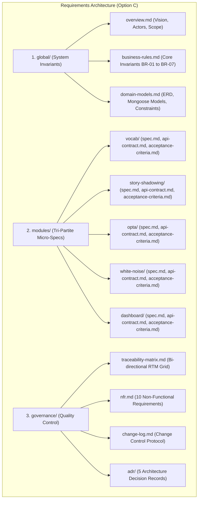
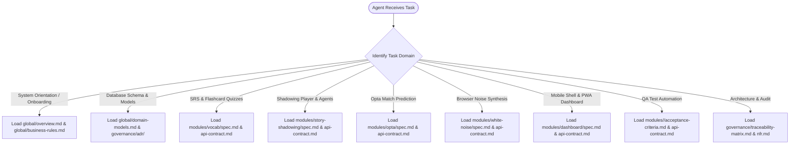

# AhaTools — Requirement Analysis Package (Enterprise Granular Architecture)

> **Version:** 1.0 (Baseline — Option C Architecture)  
> **Repository:** `aha-tools` (`aha-opta`)  
> **Methodology:** AI-Driven Context Engineering & Progressive Disclosure  
> **Author:** Anh Tú (IT Lecturer & Technical Writer)

---

## 1. Executive Summary & Architecture Overview

AhaTools is an integrated Progressive Web Application (PWA) micro-service ecosystem combining **Spaced Repetition (FSRS)**, **Agentic AI Shadowing (LangGraph)**, **Sports Predictive Analytics (Opta)**, and **Procedural Soundscape Generation (Web Audio API)**.

This requirement package is structured under **Option C (Enterprise Granular Architecture)** to prevent AI context overflow, eliminate the *Lost in the Middle* phenomenon, and establish strict bi-directional traceability between business rules and code.

---

## 2. 🧭 Just-in-Time (JIT) AI Agent Context Router

When executing tasks in this codebase, **DO NOT GREEDILY LOAD ALL REQUIREMENT FILES AT ONCE**. Follow the selective routing decision tree:

---

## 3. Directory Structure & Estimated Token Budgets

| Directory / File | Core Responsibility | Estimated Tokens | Target Consumer |
|---|---|---|---|
| **[`global/overview.md`](global/overview.md)** | Vision, Root Cause Analysis, Actors & Roles, Scope | ~1,200 tokens | All Agents / Tech Lead |
| **[`global/business-rules.md`](global/business-rules.md)** | Invariants BR-01 to BR-07, FSRS state machines | ~1,600 tokens | Backend / QA / Architect |
| **[`global/domain-models.md`](global/domain-models.md)** | Ubiquitous Language, Mermaid ERD, Mongoose Data Dictionary | ~2,200 tokens | Data / Backend / Fullstack |
| **[`modules/vocab/`](modules/vocab/)** | FSRS spaced repetition, adaptive MCQ/Cloze quizzes | ~3,200 tokens | PO / Frontend / Backend / QA |
| **[`modules/story-shadowing/`](modules/story-shadowing/)** | LangGraph YouTube pipeline, sentence-by-sentence player | ~3,400 tokens | AI Engineers / Frontend / QA |
| **[`modules/opta/`](modules/opta/)** | World Cup fixtures, Elo scraping, LangGraph predictor | ~3,200 tokens | AI Engineers / Backend / QA |
| **[`modules/white-noise/`](modules/white-noise/)** | Procedural Web Audio API synthesis, de-popped volume | ~2,400 tokens | Audio / Frontend Developers |
| **[`modules/dashboard/`](modules/dashboard/)** | Daily learning hub, continue card, mobile tab bar | ~2,600 tokens | UI / PWA Developers |
| **[`governance/traceability-matrix.md`](governance/traceability-matrix.md)** | Bi-directional RTM linking 24 FRs to ACs and APIs | ~2,000 tokens | Tech Lead / QA Lead |
| **[`governance/nfr.md`](governance/nfr.md)** | 10 Non-Functional Requirements & Performance Targets | ~1,400 tokens | DevOps / Architect |
| **[`governance/change-log.md`](governance/change-log.md)** | Versioning log & Change Request Protocol | ~800 tokens | Project Stakeholders |
| **[`governance/adr/`](governance/adr/README.md)** | 5 Architecture Decision Records (Next.js, FSRS, LangGraph, Web Audio, Facts/Opinions) | ~4,500 tokens | Software Architects |

---

*Made by Anh Tu - Share to be share*
