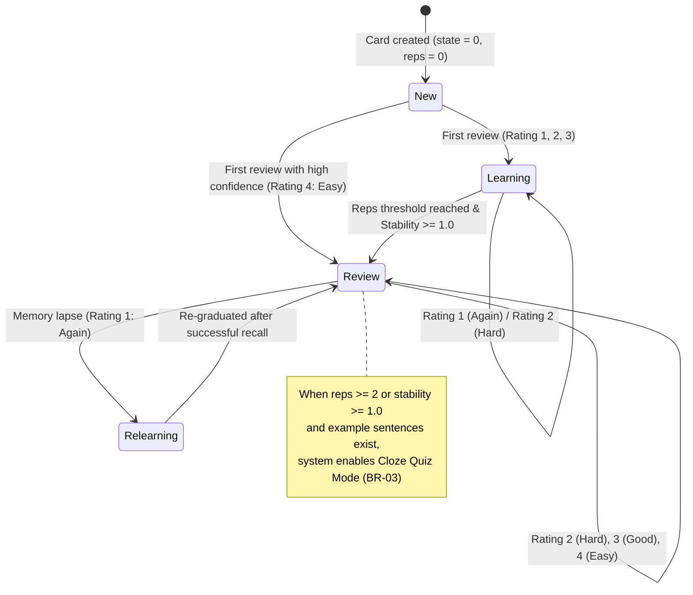
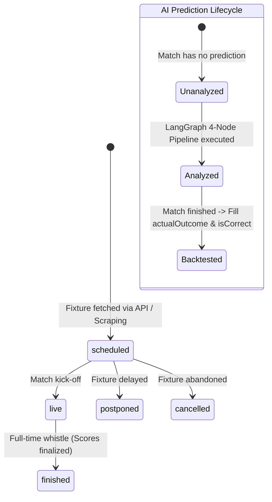

# Global 02 — Business Rules & State Machines: AhaTools

> **Parent Document:** [Requirement Analysis Package](../README.md)  
> **Version:** 1.0 (Baseline)  
> **Architecture Layer:** `global/` (System-Wide Invariants)  
> **Repository:** `aha-tools` (`aha-opta`)

---

## 1. Definition Anatomy

> **Business Rule (BR)** is *a non-negotiable normative constraint* governing entity states, state transitions, algorithms, and domain integrity. It remains valid regardless of presentation layer (UI) or transport protocols (HTTP/WebSocket), serving as the **Single Source of Truth** for domain consistency.

### Anatomical Keyword Breakdown:
* **Normative Constraint:** Invariant boundary condition that must never be broken under any operational scenario.
* **State Transition Logic:** Dictates valid lifecycles and rejects illegal state leaps (e.g., jumping from `New` directly to graduated `Review` without review attempts).
* **Domain Invariant:** Enforced across both API controllers and background ETL workers.

---

## 2. Core Business Rules

| ID | Business Rule Statement | Target Entity / Context | Enforcement Mechanism | Status |
|---|---|---|---|---|
| **BR-01** | **FSRS State Transition & Log Atomicity:** Every review submission must use valid FSRS ratings (`1: Again`, `2: Hard`, `3: Good`, `4: Easy`), update card stability/difficulty, and atomically append an immutable record to `vocab_review_logs`. | `VocabCard`, `VocabReviewLog` | `ts-fsrs` Engine + Mongoose Session | ✅ Enforced |
| **BR-02** | **Multi-Tier Distractor Hierarchy:** Quiz generation must assemble 1 correct answer + 3 distinct distractors selected via 3 priority tiers: (1) Personal Vocab Cards -> (2) Global Storybook Keywords -> (3) CEFR Distractor Bank fallback. Correct answer must never be included in distractors. | `VocabCard`, `Storybook` | `getReviewSessionQuestions` Service | ✅ Enforced |
| **BR-03** | **Adaptive Cloze Mode Threshold:** A card is presented in Cloze mode if and only if `(reps >= 2 OR stability >= 1.0) AND exampleSentences.length > 0`. Otherwise, it falls back to standard 4-option MCQ mode. | `VocabCard` | SRS Review Session Service | ✅ Enforced |
| **BR-04** | **Fact vs. Opinion Segregation:** `Match` records objective reality (facts), while `Prediction` records AI analysis (opinions). Prediction generation must never mutate match scores, venues, or status. | `Match`, `Prediction` | Schema Decoupling & Read-Only Match Queries | ✅ Enforced |
| **BR-05** | **Prediction Probability Conservation:** Sum of AI predicted outcome probabilities must equal 100% ($\text{home} + \text{draw} + \text{away} \approx 100\%$, tolerance $\pm 0.1\%$). Individual probabilities must be bounded within $[0, 100]$. | `Prediction` | Zod Validation Schema | ✅ Enforced |
| **BR-06** | **Storybook Sentence Alignment & IPA:** Each sentence in a Storybook must have a sequential 1-based `id`. For YouTube content, `0 <= startMs < endMs` must strictly hold. Word tokens must contain valid IPA transcriptions. | `Storybook` | LangGraph `sentenceSplitterNode` | ✅ Enforced |
| **BR-07** | **Zero-Network Audio Synthesis:** Procedural ambient sound (white/brown noise) must be computed in real-time using browser `AudioBuffer` and `BiquadFilterNode`. No streaming MP3 or network bandwidth may be consumed. | `WhiteNoise` Hook | Web Audio API Native Synthesis | ✅ Enforced |

---

## 3. State Machine Specifications

### 3.1 FSRS Card State Lifecycle (`BR-01`)

### 3.2 Football Match & Prediction Lifecycle (`BR-04`)

---

## 4. State Coupling & Consistency Matrix

| Operation | Source State | Target State | Invariant Condition | Failure Action |
|---|---|---|---|---|
| **Submit Card Review** | Any FSRS state | Updated state | Rating $\in \{1, 2, 3, 4\}$ | Reject with `400 Bad Request` |
| **Generate Cloze Batch** | `VocabCard` without sentences | Enriched `VocabCard` | Card must exist; Gemini API returns valid JSON sentences | Retain original card state without sentence mutation |
| **Execute Opta Prediction** | `Match.status = scheduled` | `Prediction` created | `homeTeamId` & `awayTeamId` must resolve in DB | Return `404 Team Not Found` |
| **Scrape YouTube Story** | YouTube URL / Video ID | `Storybook` record | Video has accessible captions/transcript | Return `422 Unprocessable Entity` with error message |

---

*Made by Anh Tu - Share to be share*
