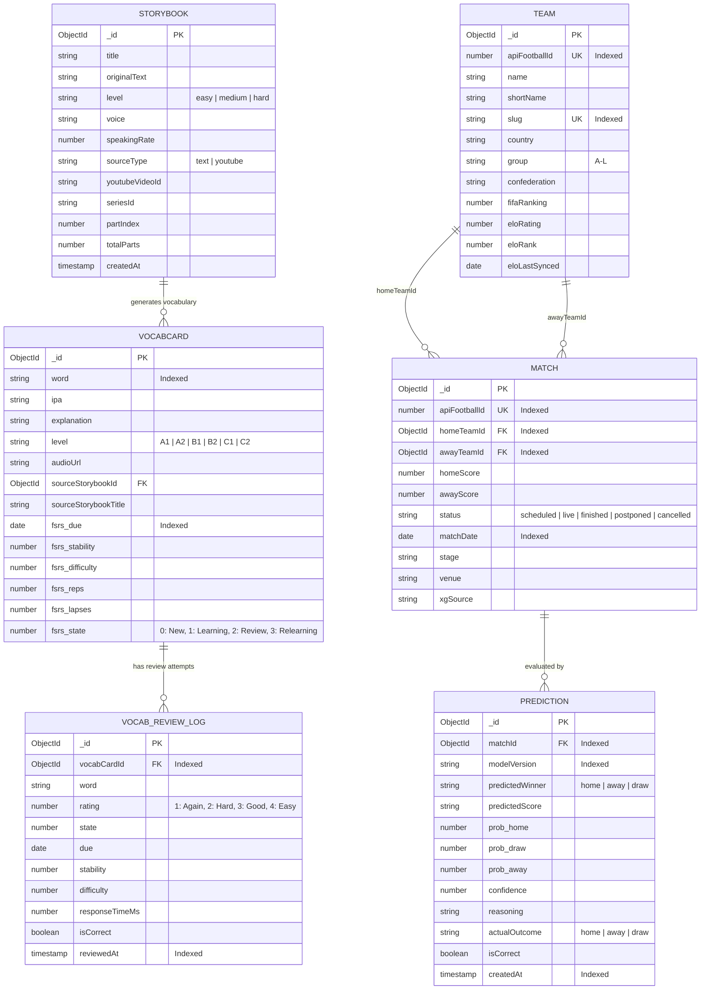

# Global 03 — Domain Models & Schema: AhaTools

> **Parent Document:** [Requirement Analysis Package](../README.md)  
> **Version:** 1.0 (Baseline)  
> **Architecture Layer:** `global/` (System-Wide Invariants)  
> **Repository:** `aha-tools` (`aha-opta`)

---

## 1. Glossary (Ubiquitous Language)

| Term (English) | Technical Definition | Business Context |
|---|---|---|
| **FSRS (Free Spaced Repetition Scheduler)** | Modern DSR (Difficulty, Stability, Retrievability) memory model outperforming SM-2. | Computes optimal review interval based on memory stability and difficulty. |
| **VocabCard** | Core flashcard entity storing word, IPA, definition, level (CEFR), and FSRS state. | Primary learning unit reviewed by the learner in SRS sessions. |
| **Cloze Quiz** | Contextual fill-in-the-blank question testing word recall inside a realistic sentence. | Advanced review mode triggered when stability $\ge 1.0$ or reps $\ge 2$. |
| **Storybook** | Collection of structured sentences with audio timestamps, IPA, and extracted keywords. | Material used for speech shadowing, imported from YouTube or raw text. |
| **Team** | National football team with aggregated performance metrics and Elo rating. | Core entity for World Cup 2026 fixture tracking and analysis. |
| **Match** | Scheduled or completed football fixture with venue, date, scores, and statistics. | Objective fact entity representing a sporting encounter. |
| **Prediction** | Probabilistic forecast generated by AI agent (LangGraph) for a specific match. | Subjective opinion entity containing win/draw/loss probabilities and reasoning. |
| **White / Brown Noise** | Procedurally synthesized stochastic audio signal simulating natural soundscapes. | Ambient background audio aiding focus, relaxation, and cognitive immersion. |

---

## 2. Entity Relationship Diagram (ERD)

---

## 3. Data Dictionary & Integrity Constraints

### 3.1 Entity: `VocabCard` (`vocab_cards`)
* `_id` (`ObjectId`, PK): Unique document identifier.
* `word` (`String`, Required, Indexed): Target English vocabulary lemma.
* `ipa` (`String`, Optional): International Phonetic Alphabet representation.
* `explanation` (`String`, Required): Vietnamese definition and conceptual explanation.
* `level` (`String`, Enum: `["A1", "A2", "B1", "B2", "C1", "C2"]`, Default: `"B1"`): CEFR proficiency level.
* `audioUrl` (`String`, Optional): Pronunciation audio link or base64 data URI.
* `exampleSentences` (`Array<ExampleSentence>`, Embedded): Array of `{ sentence, answer }` for Cloze quizzes.
* `wordFamily` (`Array<WordFamily>`, Embedded): Associated morphological word forms.
* `collocations` (`Array<Collocation>`, Embedded): High-frequency phrase combinations.
* `fsrs` (`FSRSCardState`, Embedded):
  * `due` (`Date`, Required, Indexed): Next scheduled review timestamp.
  * `stability` (`Number`, Default: 0): Memory stability in days.
  * `difficulty` (`Number`, Default: 0): Inherent card complexity (1 to 10).
  * `elapsed_days` (`Number`, Default: 0): Days elapsed since prior review.
  * `scheduled_days` (`Number`, Default: 0): Calculated interval until this review.
  * `reps` (`Number`, Default: 0): Total review repetitions.
  * `lapses` (`Number`, Default: 0): Memory failure count.
  * `state` (`Number`, Enum: `[0, 1, 2, 3]`, Default: 0): Current FSRS learning state.
  * `last_review` (`Date`, Optional): Timestamp of most recent review session.

### 3.2 Entity: `Storybook` (`storybooks`)
* `_id` (`ObjectId`, PK): Unique story identifier.
* `title` (`String`, Required): Title of the story or video episode.
* `originalText` (`String`, Required): Complete raw source transcript.
* `sentences` (`Array<StorybookSentence>`, Required): Array of `{ id, text, audioBase64, startMs, endMs, words: [{ word, ipa }] }`.
* `keywords` (`Array<StorybookKeyword>`, Optional): Vocabulary extracted by LangGraph agent.
* `level` (`String`, Enum: `["easy", "medium", "hard"]`, Required): Pedagogical difficulty level.
* `sourceType` (`String`, Enum: `["text", "youtube"]`, Default: `"text"`).
* `youtubeVideoId` (`String`, Optional): 11-character YouTube video identifier.
* `seriesId` (`String`, Optional): Identifier linking related series episodes.

### 3.3 Entity: `Match` (`matches`) & `Team` (`teams`)
* `Match.apiFootballId` (`Number`, Unique, Required): External provider ID for upsert operations.
* `Match.homeTeamId` & `awayTeamId` (`ObjectId`, Ref: `Team`, Indexed): Compound indexed with `matchDate` (`{ homeTeamId: 1, matchDate: -1 }`) for fast recent form calculation.
* `Team.eloRating` (`Number`, Default: 1500): Dynamic rating crawled from `eloratings.net`.

### 3.4 Entity: `Prediction` (`predictions`)
* `matchId` (`ObjectId`, Ref: `Match`, Indexed): Reference to evaluated match.
* `modelVersion` (`String`, Indexed): AI prompt and model identifier (e.g., `gemini-2.5-flash@opta-v1`).
* `probabilities` (`{ home: Number, draw: Number, away: Number }`): Probability distribution summing to 100%.
* `actualOutcome` (`String`, Enum: `["home", "away", "draw", null]`): Back-tested result populated after match conclusion.

### 3.5 Entity: `SpeakingQuestion` (`prep_speaking` Domain)
* `id` (`String`, Unique): Unique question identifier.
* `topic` (`String`, Required): Broad thematic domain (e.g., "Technology", "Habits", "Education").
* `question` (`String`, Required): Open-ended dilemma / opinion prompt for 30–60s speech.
* `level` (`String`, Enum: `["B1", "B2", "C1"]`, Required): Pedagogical proficiency ceiling.
* `targetKeywords` (`Array<{ word, ipa, meaning }>`): Mandatory vocabulary items to incorporate.
* `prepScaffold` (`Object`, Required):
  * `point`: `{ signposts: string[], hint: string, modelAnswer: string }`
  * `reason`: `{ signposts: string[], hint: string, modelAnswer: string }`
  * `example`: `{ signposts: string[], hint: string, modelAnswer: string }`
  * `conclusion`: `{ signposts: string[], hint: string, modelAnswer: string }`

---

## 4. Architectural Constraints & ADR Mapping

| Constraint ID | Constraint Title | Governing ADR |
|---|---|---|
| **CON-01** | Next.js 16 App Router & React 19 Client-Server Boundary | [ADR-001](../governance/adr/001-nextjs-app-router-react19.md) |
| **CON-02** | DSR-based Spaced Repetition via `ts-fsrs` | [ADR-002](../governance/adr/002-fsrs-spaced-repetition.md) |
| **CON-03** | LangGraph State Graph Agent Pipelines | [ADR-003](../governance/adr/003-langgraph-agent-orchestration.md) |
| **CON-04** | In-Browser Web Audio API Mathematical Synthesis | [ADR-004](../governance/adr/004-web-audio-api-synthesis.md) |
| **CON-05** | Document Segregation: Immutable Match Facts vs. Modifiable AI Predictions | [ADR-005](../governance/adr/005-mongodb-fact-opinion-split.md) |
| **CON-06** | PREP Framework & Progressive Model Disclosure for Speaking Quizzes | [ADR-006](../governance/adr/006-prep-scaffolded-speaking-quiz.md) |

---

*Made by Anh Tu - Share to be share*
