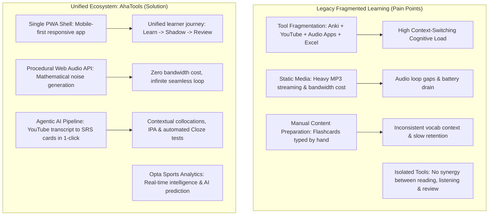

# Global 01 — Business Goal, Scope & Context: AhaTools

> **Parent Document:** [Requirement Analysis Package](../README.md)  
> **Version:** 1.0 (Baseline)  
> **Architecture Layer:** `global/` (System-Wide Invariants)  
> **Repository:** `aha-tools` (`aha-opta`)

---

## 1. Definition Anatomy

> **AhaTools** is an *integrated Progressive Web Application (PWA) micro-service ecosystem* designed for **cognitive enhancement and self-directed multimodal learning**, combining **Spaced Repetition Systems (FSRS)**, **Agentic AI Shadowing (LangGraph)**, **Sports Predictive Analytics (Opta)**, and **Procedural Soundscape Generation (Web Audio API)**.

### Anatomical Keyword Breakdown:
* **Progressive Web Application (PWA):** Installs seamlessly on mobile and desktop operating systems with offline caching via Service Worker (`public/sw.js`), eliminating native app store friction.
* **Multimodal Learning:** Engages visual (cloze/MCQ quiz cards), auditory (Google Cloud TTS, procedural brown noise), and kinesthetic cognitive pathways simultaneously.
* **Agentic AI Orchestration:** Employs multi-node directed graphs (`@langchain/langgraph`) to decompose complex workflows (transcription, sentence segmentation, IPA phonetics, dictionary enrichment, and probabilistic prediction) into deterministic, testable nodes.
* **Procedural Synthesis:** Synthesizes sound mathematically in-browser via the Web Audio API rather than streaming static MP3 assets, eliminating bandwidth costs and loop gaps.

---

## 2. Root Cause Analysis

Why does AhaTools exist? The following diagram contrasts the fragmented, high-friction learning experience of legacy workflows with the unified architecture of AhaTools:

---

## 3. Actors & Role-Based Access Control (RBAC)

| Actor | Real-World Role | System Role Identifier | Core Permissions & Capabilities |
|---|---|---|---|
| **Learner (End User)** | Self-directed student / professional | `learner` | Review due flashcards, play MCQ/Cloze quizzes, listen to shadowing audio, toggle ambient white/brown noise, view match predictions. |
| **Curator / Power User** | Content creator & learner | `curator` | Import YouTube URLs, initiate automated LangGraph series segmentation, trigger AI Cloze batch enrichment, create custom vocabulary cards. |
| **System Automation / Worker** | Automated cron daemon / ETL | `system_worker` | Execute scheduled match fixtures auto-fetch, crawl Elo ratings from external sources, update FSRS stability states. |

---

## 4. Project Scope

### 4.1 In-Scope (Baseline Features)
1. **SRS Vocabulary Engine:** Full implementation of the Free Spaced Repetition Scheduler (`ts-fsrs`), dual quiz modes (MCQ & Cloze), incidental distractor generation from Storybooks, and audio pronunciation.
2. **Story & YouTube Shadowing:** LangGraph-powered transcript scraping, sentence splitting with IPA phonetics, keyword enrichment, text-to-speech generation, and sentence-by-sentence player.
3. **Opta Sports Intelligence:** Match and team statistics management, Elo rating scraper, Tavily expert opinion synthesis, and 4-node LangGraph match outcome predictor.
4. **Procedural White Noise:** Client-side Web Audio API brown/white noise synthesis, lowpass filtering, volume slider, and sleep timer.
5. **Mobile Shell & PWA Dashboard:** Responsive app shell with bottom navigation bar, due review counter badge, greeting header, quick app shortcuts, and service worker registration.

### 4.2 Out-of-Scope (Deferred / Future Iterations)
* Multi-tenant user authentication (currently single-learner local profile mode).
* Real-time peer-to-peer multiplayer quiz competitions.
* Direct real-money sports betting integrations.
* Native mobile app store deployments (PWA install fulfills all platform distribution requirements).

---

*Made by Anh Tu - Share to be share*
