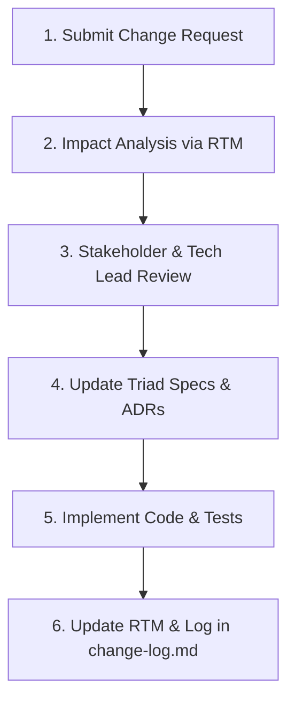

# Governance — Change Control & Version History: AhaTools

> **Parent Document:** [Requirement Analysis Package](../README.md)  
> **Version:** 1.0 (Baseline)  
> **Repository:** `aha-tools` (`aha-opta`)

---

## 1. Version History Log

| Version | Release Date | Author / Role | Summary of Changes |
|---|---|---|---|
| **1.0** | 2026-09-30 | Anh Tú (IT Lecturer / Architect) | Initial baseline specification package scaffolding under Option C (Enterprise Granular Architecture). Established tri-partite micro-specs across 5 domains (`vocab`, `story-shadowing`, `opta`, `white-noise`, `dashboard`), mapped 5 ADRs, 10 NFRs, and verified bi-directional RTM grid. |
| **1.1** | 2026-09-30 | Anh Tú (IT Lecturer / Architect) | **CR-01 (Speak Your Mind / PREP Speaking Quiz):** Added specification for 3rd quiz mode `prep_speaking` in `vocab` module. Defined `BR-08`, `ISpeakingQuestion` domain model, `ADR-006` (PREP Scaffolding & Progressive Model Reveal), `FR-VOCAB-06`, `US-VOCAB-03`, `AC-VOCAB-06`, `AC-VOCAB-07`, and updated RTM grid. |

---

## 2. Change Request (CR) Protocol

1. **Change Proposal:** Submit formal CR with business rationale, target module, and expected impact.
2. **Impact Analysis:** Cross-reference `traceability-matrix.md` to identify all affected specifications (`spec.md`), HTTP schemas (`api-contract.md`), and test boundaries (`acceptance-criteria.md`).
3. **Review & Architectural Approval:** Verify that the proposed change does not violate [`global/business-rules.md`](../global/business-rules.md) or contradict established [`governance/adr/`](adr/README.md) records.
4. **Specification Update:** Update the relevant micro-spec triad files *before* altering code.
5. **Code Implementation & Verification:** Code changes must be accompanied by automated tests verifying updated acceptance criteria.
6. **Governance Sign-off:** Update `traceability-matrix.md` status and log the release entry here.

---

*Made by Anh Tu - Share to be share*
