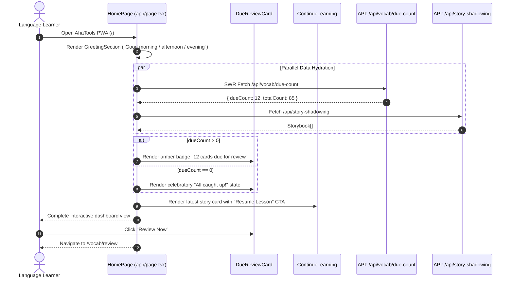
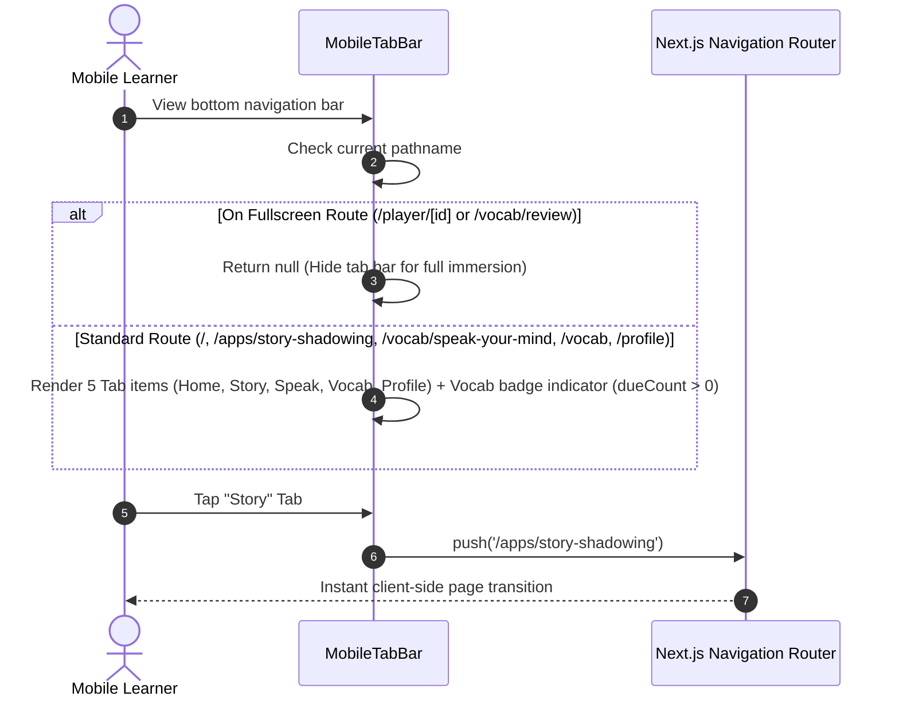

# Module DASHBOARD — Business Specification

> **Parent Document:** [Requirement Analysis Package](../../README.md)  
> **Module ID:** `DASH` | **Domain:** Central Learning Hub & Mobile PWA Shell  
> **Linked Documents:** [API Contract](api-contract.md) | [Acceptance Criteria](acceptance-criteria.md)

---

## 1. Business Objective

Provide a unified, frictionless entry point for all AhaTools micro-applications. Maximize daily learning consistency by highlighting **overdue SRS flashcards**, displaying a **"Continue Learning"** resume card for recent speech shadowing sessions, presenting **quick navigation shortcuts**, and enclosing the experience within a responsive **Mobile PWA Shell** with bottom navigation tabs and offline service worker caching.

---

## 2. Functional Requirements

| FR ID | Feature Description | Actor | Pre-condition | Post-condition | Mapped API / Contract | Target AC |
|---|---|---|---|---|---|---|
| **FR-DASH-01** | Render Dynamic Time-of-Day Greeting | Learner | App opened | Displays personalized greeting based on current local hour | Client-side Component Contract | [`AC-DASH-01`](acceptance-criteria.md#ac-dash-01) |
| **FR-DASH-02** | Display Overdue SRS Review Alert Banner | Learner | `dueCount > 0` | Renders high-priority action card linking directly to `/vocab/review` | [`GET /api/vocab/due-count`](api-contract.md#11-consumed-api-endpoints) | [`AC-DASH-02`](acceptance-criteria.md#ac-dash-02) |
| **FR-DASH-03** | Display "Continue Learning" Resume Card | Learner | Recent storybook exists | Shows most recent story with title, level, and one-tap resume button | [`GET /api/story-shadowing`](api-contract.md#11-consumed-api-endpoints) | [`AC-DASH-03`](acceptance-criteria.md#ac-dash-03) |
| **FR-DASH-04** | Bottom Mobile Tab Bar with Notification Badges | Learner | App shell rendered | Renders fixed bottom bar with Home, Story, Speak, Vocab, Profile & due count badge | [`MobileTabBar`](api-contract.md#12-shell-contracts) | [`AC-DASH-04`](acceptance-criteria.md#ac-dash-04) |
| **FR-DASH-05** | Register Offline PWA Service Worker | Learner | Browser supports ServiceWorker | Registers `/sw.js` for standalone installation and asset caching | [`PWARegister`](api-contract.md#12-shell-contracts) | [`AC-DASH-05`](acceptance-criteria.md#ac-dash-05) |

---

## 3. User Stories

### US-DASH-01: View Daily Hub & Act on Due Reviews
- **ID:** `US-DASH-01`
- **Actor:** Learner
- **Priority:** Must-have
- **Mapped FR:** [`FR-DASH-01`](#2-functional-requirements), [`FR-DASH-02`](#2-functional-requirements), [`FR-DASH-03`](#2-functional-requirements)
- **Mapped API:** [`GET /api/vocab/due-count`](api-contract.md#11-consumed-api-endpoints), [`GET /api/story-shadowing`](api-contract.md#11-consumed-api-endpoints)
- **Mapped Acceptance Criteria:** [`AC-DASH-01`](acceptance-criteria.md#ac-dash-01), [`AC-DASH-02`](acceptance-criteria.md#ac-dash-02), [`AC-DASH-03`](acceptance-criteria.md#ac-dash-03)

**User Story Statement:**
> As a returning learner,  
> I want my home dashboard to immediately tell me how many flashcards need review today and let me resume my last shadowing lesson with one tap,  
> So that I waste zero time deciding what to study next.

#### Sequence Diagram

---

### US-DASH-02: Seamless Navigation Across Micro-Apps
- **ID:** `US-DASH-02`
- **Actor:** Learner
- **Priority:** Must-have
- **Mapped FR:** [`FR-DASH-04`](#2-functional-requirements)
- **Mapped Contract:** [`MobileTabBar`](api-contract.md#12-shell-contracts)
- **Mapped Acceptance Criteria:** [`AC-DASH-04`](acceptance-criteria.md#ac-dash-04)

**User Story Statement:**
> As a mobile user,  
> I want a persistent bottom navigation bar displaying an overdue counter badge and dedicated tabs for speaking and vocabulary,  
> So that I can switch instantly between Home, Shadowing, Speak Your Mind, Vocab, and Profile, while hiding the bar inside full-screen player modes.

#### Sequence Diagram

---

*Made by Anh Tu - Share to be share*
