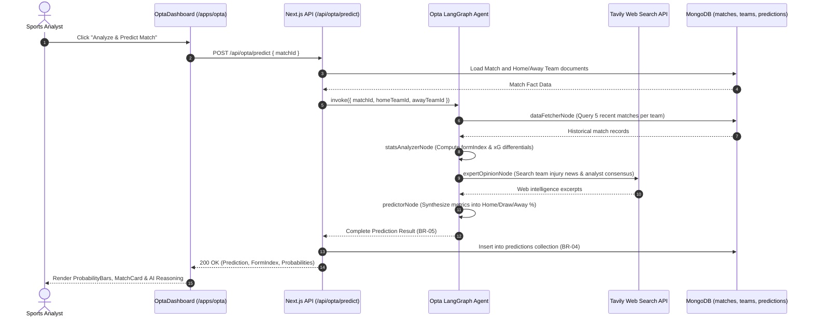
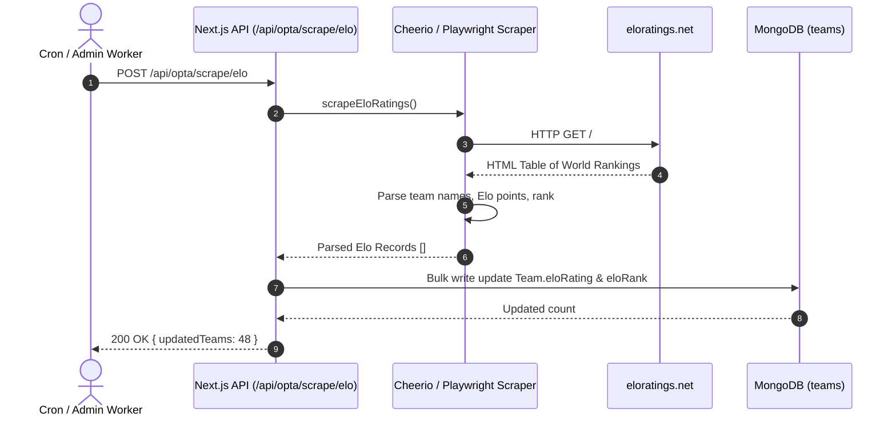

# Module OPTA — Business Specification

> **Parent Document:** [Requirement Analysis Package](../../README.md)  
> **Module ID:** `OPTA` | **Domain:** Football Intelligence & AI Match Outcome Forecasting  
> **Linked Documents:** [API Contract](api-contract.md) | [Acceptance Criteria](acceptance-criteria.md)

---

## 1. Business Objective

Provide sports analysts and fans with deep, data-driven football insights and probabilistic forecasting for the FIFA World Cup 2026. Replace subjective guesswork with a structured **4-Node LangGraph Agent** integrating **historical form (xG/Elo)**, **live web intelligence (Tavily search)**, and **bookmaker market signals**, while strictly separating verifiable facts from subjective AI opinions ([`BR-04`](../../global/business-rules.md#br-04)).

---

## 2. Functional Requirements

| FR ID | Feature Description | Actor | Pre-condition | Post-condition | Mapped API Endpoint | Target AC |
|---|---|---|---|---|---|---|
| **FR-OPTA-01** | Query Matches by Tournament Stage or Status | Learner / Analyst | Database populated with fixtures | Returns list of matches with home/away team details and scores | [`GET /api/opta/matches`](api-contract.md#11-get-apioptamatches) | [`AC-OPTA-01`](acceptance-criteria.md#ac-opta-01) |
| **FR-OPTA-02** | Execute AI Match Prediction Pipeline | Analyst | Match exists with `status: scheduled` | Executes 4-node LangGraph agent, saves `Prediction` record | [`POST /api/opta/predict`](api-contract.md#12-post-apioptapredict) | [`AC-OPTA-02`](acceptance-criteria.md#ac-opta-02) |
| **FR-OPTA-03** | Crawl & Update Elo Ratings | System Worker | Network access to `eloratings.net` | Updates `eloRating` and `recentEloMatches` for all national teams | [`POST /api/opta/scrape/elo`](api-contract.md#13-post-apioptascrapeelo) | [`AC-OPTA-03`](acceptance-criteria.md#ac-opta-03) |
| **FR-OPTA-04** | Sync Match Results & Back-test Predictions | System Worker | Finished matches recorded | Updates `Match.status = finished`, computes `Prediction.isCorrect` | [`POST /api/opta/sync`](api-contract.md#14-post-apioptasync) | [`AC-OPTA-04`](acceptance-criteria.md#ac-opta-04) |
| **FR-OPTA-05** | View Team Rankings & Aggregated Stats | Learner / Analyst | Teams indexed | Returns 48 World Cup teams with Elo rank, form, and group | [`GET /api/opta/teams`](api-contract.md#15-get-apioptateams) | [`AC-OPTA-05`](acceptance-criteria.md#ac-opta-05) |

---

## 3. User Stories

### US-OPTA-01: View AI Match Prediction & Probability Breakdown
- **ID:** `US-OPTA-01`
- **Actor:** Sports Analyst / Learner
- **Priority:** Must-have
- **Mapped FR:** [`FR-OPTA-01`](#2-functional-requirements), [`FR-OPTA-02`](#2-functional-requirements)
- **Mapped API:** [`GET /api/opta/matches`](api-contract.md#11-get-apioptamatches), [`POST /api/opta/predict`](api-contract.md#12-post-apioptapredict)
- **Mapped Acceptance Criteria:** [`AC-OPTA-01`](acceptance-criteria.md#ac-opta-01), [`AC-OPTA-02`](acceptance-criteria.md#ac-opta-02)

**User Story Statement:**
> As a football enthusiast and analyst,  
> I want to inspect win/draw/loss probability distributions, predicted scores, and qualitative reasoning for upcoming fixtures,  
> So that I can evaluate tactical matchups backed by historical stats and recent injury news.

#### Sequence Diagram

---

### US-OPTA-02: Crawl Dynamic Elo Ratings
- **ID:** `US-OPTA-02`
- **Actor:** System Worker / Analyst
- **Priority:** Should-have
- **Mapped FR:** [`FR-OPTA-03`](#2-functional-requirements)
- **Mapped API:** [`POST /api/opta/scrape/elo`](api-contract.md#13-post-apioptascrapeelo)
- **Mapped Acceptance Criteria:** [`AC-OPTA-03`](acceptance-criteria.md#ac-opta-03)

**User Story Statement:**
> As an automated system worker,  
> I want to periodically crawl Elo ratings and recent match history from `eloratings.net`,  
> So that team strength metrics remain continually calibrated before predictions execute.

#### Sequence Diagram

---

*Made by Anh Tu - Share to be share*
