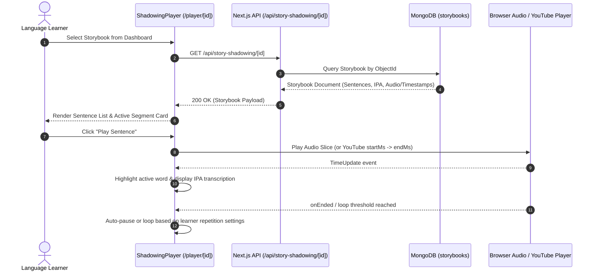
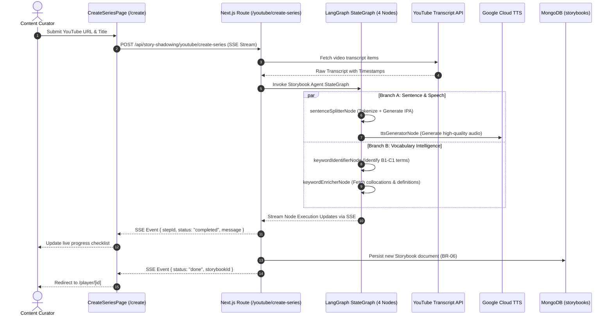

# Module STORY-SHADOWING — Business Specification

> **Parent Document:** [Requirement Analysis Package](../../README.md)
> **Module ID:** `SHADOW` | **Domain:** AI-Assisted Speech Shadowing & YouTube Series Processing
> **Linked Documents:** [API Contract](api-contract.md) | [Acceptance Criteria](acceptance-criteria.md)

---

## 1. Business Objective

Empower language learners to achieve spoken fluency and natural rhythm through **Speech Shadowing** (speaking simultaneously with native audio). Decompose native content (YouTube videos or custom essays) into structured, timed sentences with **word-by-word IPA phonetics**, **Google Cloud TTS narration**, and **automated vocabulary keyword extraction** orchestrated by LangGraph multi-agent pipelines.

---

## 2. Functional Requirements

| FR ID                  | Feature Description                           | Actor   | Pre-condition              | Post-condition                                                             | Mapped API Endpoint                                                                                                        | Target AC                                              |
| ---------------------- | --------------------------------------------- | ------- | -------------------------- | -------------------------------------------------------------------------- | -------------------------------------------------------------------------------------------------------------------------- | ------------------------------------------------------ |
| **FR-SHADOW-01** | Browse & Filter Storybook Library             | Learner | App shell rendered         | Returns list of available storybooks with metadata and sentence counts     | [`GET /api/story-shadowing`](api-contract.md#11-get-apistory-shadowing)                                                   | [`AC-SHADOW-01`](acceptance-criteria.md#ac-shadow-01) |
| **FR-SHADOW-02** | Fetch Full Storybook Player Payload           | Learner | Storybook selected by ID   | Returns sentences with audio timestamps, IPA words, and extracted keywords | [`GET /api/story-shadowing/:id`](api-contract.md#12-get-apistory-shadowingid)                                             | [`AC-SHADOW-02`](acceptance-criteria.md#ac-shadow-02) |
| **FR-SHADOW-03** | Suggest Series Segments from YouTube Video    | Curator | Valid YouTube URL provided | LangChain extracts transcript and returns logical chunk suggestions        | [`POST /api/story-shadowing/youtube/suggest-segments`](api-contract.md#13-post-apistory-shadowingyoutubesuggest-segments) | [`AC-SHADOW-03`](acceptance-criteria.md#ac-shadow-03) |
| **FR-SHADOW-04** | Stream Multi-Node LangGraph Series Generation | Curator | Segments confirmed by user | Executes parallel LangGraph graph, streams SSE progress, saves series      | [`POST /api/story-shadowing/youtube/create-series`](api-contract.md#14-post-apistory-shadowingyoutubecreate-series)       | [`AC-SHADOW-04`](acceptance-criteria.md#ac-shadow-04) |
| **FR-SHADOW-05** | Delete Storybook Entry                        | Curator | Target storybook exists    | Removes Storybook document from MongoDB                                    | [`DELETE /api/story-shadowing/:id`](api-contract.md#15-delete-apistory-shadowingid)                                       | [`AC-SHADOW-05`](acceptance-criteria.md#ac-shadow-05) |

---

## 3. User Stories

### US-SHADOW-01: Interactive Sentence-by-Sentence Shadowing Practice

- **ID:** `US-SHADOW-01`
- **Actor:** Learner
- **Priority:** Must-have
- **Mapped FR:** [`FR-SHADOW-01`](#2-functional-requirements), [`FR-SHADOW-02`](#2-functional-requirements)
- **Mapped API:** [`GET /api/story-shadowing/:id`](api-contract.md#12-get-apistory-shadowingid)
- **Mapped Acceptance Criteria:** [`AC-SHADOW-01`](acceptance-criteria.md#ac-shadow-01), [`AC-SHADOW-02`](acceptance-criteria.md#ac-shadow-02)

**User Story Statement:**

> As an intermediate English learner,
> I want to play each sentence repeatedly with synchronized highlighting, IPA phonetic transcriptions, and adjustable playback speed,
> So that I can master native pronunciation, intonation, and connected speech.

#### Sequence Diagram

---

### US-SHADOW-02: Import YouTube Video & Auto-Generate Multi-Part Series

- **ID:** `US-SHADOW-02`
- **Actor:** Curator / Learner
- **Priority:** Must-have
- **Mapped FR:** [`FR-SHADOW-03`](#2-functional-requirements), [`FR-SHADOW-04`](#2-functional-requirements)
- **Mapped API:** [`POST /api/story-shadowing/youtube/create-series`](api-contract.md#14-post-apistory-shadowingyoutubecreate-series)
- **Mapped Acceptance Criteria:** [`AC-SHADOW-03`](acceptance-criteria.md#ac-shadow-03), [`AC-SHADOW-04`](acceptance-criteria.md#ac-shadow-04)

**User Story Statement:**

> As a content curator,
> I want to paste a YouTube video URL and have the LangGraph agent split the transcript, generate IPA, identify B1/B2 keywords, and synthesize audio in parallel,
> So that I can transform a 15-minute video into study-ready shadowing lessons in under 60 seconds.

#### Sequence Diagram

---

*Made by Anh Tu - Share to be share*
