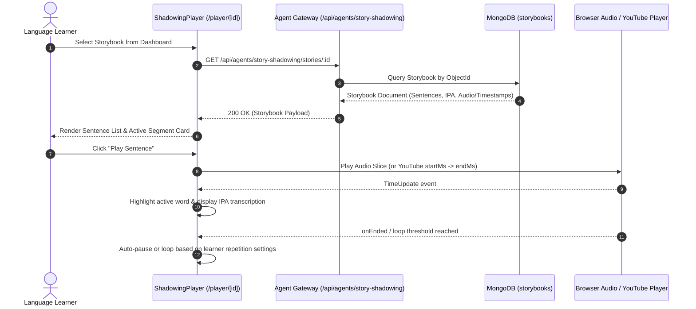

# Module STORY-SHADOWING — Business Specification

> **Parent Document:** [Requirement Analysis Package](../../README.md)  
> **Module ID:** `SHADOW` | **Domain:** AI-Assisted Speech Shadowing & YouTube Multi-Agent Processing  
> **Linked Documents:** [API Contract](api-contract.md) | [Agent API Contract v2.0](aha-mind-agents-api-contract.md) | [Acceptance Criteria](acceptance-criteria.md)  
> **Specification Version:** 2.0.0 (Asynchronous BullMQ + Redis Pub/Sub + GET SSE Architecture)

---

## 1. Business Objective

Empower language learners to achieve spoken fluency and natural rhythm through **Speech Shadowing** (speaking simultaneously with native audio). Decompose native content (YouTube videos or custom texts) into structured, timed sentences with **word-by-word IPA phonetics**, **Google Cloud TTS narration**, and **automated vocabulary keyword extraction** orchestrated by LangGraph multi-agent pipelines running asynchronously on `aha-mind-agents`.

---

## 2. Functional Requirements

| FR ID | Feature Description | Actor | Pre-condition | Post-condition | Mapped API Endpoint | Target AC |
| :--- | :--- | :--- | :--- | :--- | :--- | :--- |
| **FR-SHADOW-01** | Browse & Filter Storybook Library | Learner | App shell rendered | Returns list of available storybooks with metadata, CEFR level, and sentence counts | [`GET /api/agents/story-shadowing/stories`](aha-mind-agents-api-contract.md#24-truy-vấn-danh-sách-bài-học-flexible-filters) | [`AC-SHADOW-01`](acceptance-criteria.md#ac-shadow-01) |
| **FR-SHADOW-02** | Fetch Full Storybook Player Payload | Learner | Storybook selected by ID | Returns sentences with audio timestamps, word-by-word IPA, and enriched keywords | [`GET /api/agents/story-shadowing/stories/:id`](aha-mind-agents-api-contract.md#23-lấy-dữ-liệu-chi-tiết-bài-học-storybook-theo-id) | [`AC-SHADOW-02`](acceptance-criteria.md#ac-shadow-02) |
| **FR-SHADOW-03** | Asynchronous Job Enqueue (Text & YouTube) | Curator / Learner | Valid text (10-10k chars) or valid YouTube URL | Returns `202 Accepted` with `jobId` & `sseUrl`, or returns existing story immediately if idempotent hit | [`POST /api/agents/story-shadowing/jobs`](aha-mind-agents-api-contract.md#21-kích-hoạt-job-tạo-bài-học-shadowing-asynchronous-job-enqueue) | [`AC-SHADOW-03`](acceptance-criteria.md#ac-shadow-03) |
| **FR-SHADOW-04** | Real-time GET SSE Progress Stream | Client | Job enqueued with active `jobId` | Streams pipeline progress events (`sentenceSplitter`, `ttsGenerator`, `keywordIdentifier`, `keywordEnricher`) via native `EventSource` | [`GET /api/agents/story-shadowing/jobs/:jobId/progress`](aha-mind-agents-api-contract.md#22-lắng-nghe-tiến-trình-thời-gian-thực-qua-server-sent-events-get-sse) | [`AC-SHADOW-04`](acceptance-criteria.md#ac-shadow-04) |
| **FR-SHADOW-05** | Delete Storybook Entry | Curator | Target storybook exists | Removes Storybook document from MongoDB and purges static cache | [`DELETE /api/story-shadowing/:id`](api-contract.md#15-delete-apistory-shadowingid) | [`AC-SHADOW-05`](acceptance-criteria.md#ac-shadow-05) |
| **FR-SHADOW-06** | Idempotent Fast-Path Retrieval (<50ms) | Curator / Learner | YouTube URL already processed in DB & `forceRegenerate === false` | Returns `status: "completed"` with `existingStoryId` in <50ms without enqueuing BullMQ job | [`POST /api/agents/story-shadowing/jobs`](aha-mind-agents-api-contract.md#21-kích-hoạt-job-tạo-bài-học-shadowing-asynchronous-job-enqueue) | [`AC-SHADOW-06`](acceptance-criteria.md#ac-shadow-06) |
| **FR-SHADOW-07** | Supadata Transcript Retrieval & Segment Suggestion | Curator / Learner | Valid YouTube URL & `SUPADATA_API_KEY` configured | Fetches captions via residential proxy without datacenter IP blocks, assesses duration, and suggests segments via `useYoutubeSegments` hook | [`POST /api/story-shadowing/youtube/suggest-segments`](api-contract.md#13-post-apistory-shadowingyoutubesuggest-segments) | [`AC-SHADOW-07`](acceptance-criteria.md#ac-shadow-07) |

---

## 3. User Stories

### US-SHADOW-01: Interactive Sentence-by-Sentence Shadowing Practice

- **ID:** `US-SHADOW-01`
- **Actor:** Learner
- **Priority:** Must-have
- **Mapped FR:** [`FR-SHADOW-01`](#2-functional-requirements), [`FR-SHADOW-02`](#2-functional-requirements)
- **Mapped API:** [`GET /api/agents/story-shadowing/stories/:id`](aha-mind-agents-api-contract.md#23-lấy-dữ-liệu-chi-tiết-bài-học-storybook-theo-id)
- **Mapped Acceptance Criteria:** [`AC-SHADOW-01`](acceptance-criteria.md#ac-shadow-01), [`AC-SHADOW-02`](acceptance-criteria.md#ac-shadow-02)

**User Story Statement:**

> As an intermediate English learner,  
> I want to play each sentence repeatedly with synchronized highlighting, IPA phonetic transcriptions, and adjustable playback speed,  
> So that I can master native pronunciation, intonation, and connected speech.

#### Sequence Diagram



---

### US-SHADOW-02: Import YouTube Video & Auto-Generate Shadowing Lesson via Agent Gateway

- **ID:** `US-SHADOW-02`
- **Actor:** Curator / Learner
- **Priority:** Must-have
- **Mapped FR:** [`FR-SHADOW-03`](#2-functional-requirements), [`FR-SHADOW-04`](#2-functional-requirements)
- **Mapped API:** [`POST /api/agents/story-shadowing/jobs`](aha-mind-agents-api-contract.md#21-kích-hoạt-job-tạo-bài-học-shadowing-asynchronous-job-enqueue), [`GET /api/agents/story-shadowing/jobs/:jobId/progress`](aha-mind-agents-api-contract.md#22-lắng-nghe-tiến-trình-thời-gian-thực-qua-server-sent-events-get-sse)
- **Mapped Acceptance Criteria:** [`AC-SHADOW-03`](acceptance-criteria.md#ac-shadow-03), [`AC-SHADOW-04`](acceptance-criteria.md#ac-shadow-04)

**User Story Statement:**

> As a content curator or learner,  
> I want to submit a YouTube video URL or English text and track real-time generation progress through an asynchronous BullMQ queue with SSE streaming,  
> So that long-running operations never trigger HTTP 504 timeouts and I can observe exactly which node (IPA, TTS, Keywords) is currently executing.

#### Sequence Diagram

```mermaid
sequenceDiagram
    autonumber
    actor Curator as Content Curator / Learner
    participant UI as CreateStoryPage (/create)
    participant GW as Agent Gateway (/api/agents/story-shadowing)
    participant Redis as BullMQ Queue & Redis Pub/Sub
    participant Worker as StoryShadowingWorker (LangGraph)
    participant DB as MongoDB (storybooks)

    Curator->>UI: Submit YouTube URL or Text
    UI->>GW: POST /api/agents/story-shadowing/jobs { pipeline, text | youtubeUrl }
    
    alt Idempotent Hit (Video already exists & forceRegenerate = false)
        GW-->>UI: 202 Accepted { jobId: "existing-...", status: "completed", existingStoryId }
        UI->>GW: GET /api/agents/story-shadowing/stories/:existingStoryId
        GW-->>UI: 200 OK (Storybook)
        UI-->>Curator: Immediate redirect to /player/[id] (<50ms)
    else New Job Enqueued
        GW->>Redis: Enqueue Job to 'story-shadowing-queue'
        GW-->>UI: 202 Accepted { jobId: "12", status: "queued", sseUrl }
        
        UI->>GW: GET /api/agents/story-shadowing/jobs/:jobId/progress (Accept: text/event-stream)
        Worker->>Redis: Dequeue Job & execute LangGraph StateGraph
        
        loop Stream Progress
            Worker->>Redis: Publish progress event (stepId, progress %, message)
            Redis-->>GW: Forward Redis event
            GW-->>UI: SSE Chunk (data: { stepId, progress, message })
            UI-->>Curator: Update live animated progress stepper
        end

        Worker->>DB: Persist finalized Storybook document
        Worker->>Redis: Publish status: "done" (progress: 100, storyId)
        Redis-->>GW-->>UI: SSE Chunk { status: "done", payload: { storyId } }
        UI->>UI: Close EventSource & trigger revalidateStoryShadowing()
        UI-->>Curator: Redirect to /player/[storyId]
    end
```

---

### US-SHADOW-03: Instant Idempotency Access for Re-imported Videos

- **ID:** `US-SHADOW-03`
- **Actor:** Learner / Curator
- **Priority:** High
- **Mapped FR:** [`FR-SHADOW-06`](#2-functional-requirements)
- **Mapped API:** [`POST /api/agents/story-shadowing/jobs`](aha-mind-agents-api-contract.md#21-kích-hoạt-job-tạo-bài-học-shadowing-asynchronous-job-enqueue)
- **Mapped Acceptance Criteria:** [`AC-SHADOW-06`](acceptance-criteria.md#ac-shadow-06)

**User Story Statement:**

> As a learner importing a popular YouTube video that another user has already processed,  
> I want the system to immediately recognize the video and open the practice player in less than 50ms,  
> So that I don't waste time waiting for redundant AI processing or re-synthesizing audio.

---

*Made by Anh Tu - Share to be share*
