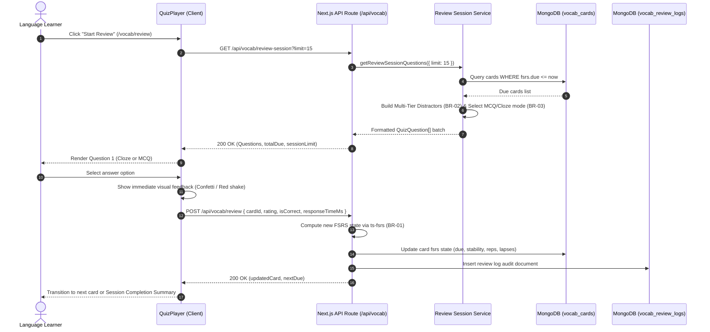
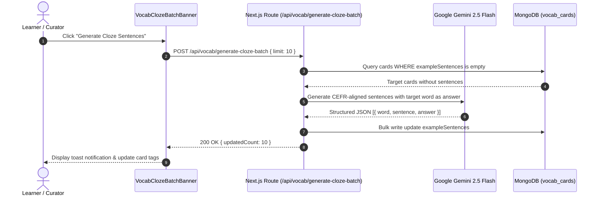

# Module VOCAB — Business Specification

> **Parent Document:** [Requirement Analysis Package](../../README.md)  
> **Module ID:** `VOCAB` | **Domain:** Spaced Repetition Vocabulary & Adaptive Quizzing  
> **Linked Documents:** [API Contract](api-contract.md) | [Acceptance Criteria](acceptance-criteria.md)

---

## 1. Business Objective

Accelerate long-term vocabulary acquisition and prevent forgetting through the modern **Free Spaced Repetition Scheduler (FSRS)**. Provide an adaptive quiz experience that seamlessly evolves from recognition-based **Multiple Choice Questions (MCQ)** to production-based **Contextual Cloze (Fill-in-the-blank)** questions as memory stability strengthens.

---

## 2. Functional Requirements

| FR ID | Feature Description | Actor | Pre-condition | Post-condition | Mapped API Endpoint | Target AC |
|---|---|---|---|---|---|---|
| **FR-VOCAB-01** | Query Due Review Count for Navigation Badge | Learner | App shell rendered | Returns integer count of cards where `due <= now` | [`GET /api/vocab/due-count`](api-contract.md#11-get-apivocabdue-count) | [`AC-VOCAB-01`](acceptance-criteria.md#ac-vocab-01) |
| **FR-VOCAB-02** | Fetch Adaptive Review Session Questions | Learner | `dueCount > 0` or `practiceAll = true` | Returns randomized batch of MCQ/Cloze questions with 4 distinct options | [`GET /api/vocab/review-session`](api-contract.md#12-get-apivocabreview-session) | [`AC-VOCAB-02`](acceptance-criteria.md#ac-vocab-02) |
| **FR-VOCAB-03** | Submit Card Review Rating & Update FSRS State | Learner | Active quiz question completed | Atomic FSRS recalculation, log entry saved, next interval scheduled | [`POST /api/vocab/review`](api-contract.md#13-post-apivocabreview) | [`AC-VOCAB-03`](acceptance-criteria.md#ac-vocab-03) |
| **FR-VOCAB-04** | Batch Generate AI Cloze Example Sentences | Curator | Cards lack example sentences | Gemini AI generates contextual sentences with blanks; card updated | [`POST /api/vocab/generate-cloze-batch`](api-contract.md#14-post-apivocabgenerate-cloze-batch) | [`AC-VOCAB-04`](acceptance-criteria.md#ac-vocab-04) |
| **FR-VOCAB-05** | Stream Word Pronunciation Audio | Learner | Audio icon clicked in card or quiz | Returns binary audio/mpeg from Google TTS or local cache | [`GET /api/vocab/audio`](api-contract.md#15-get-apivocabaudio) | [`AC-VOCAB-05`](acceptance-criteria.md#ac-vocab-05) |

---

## 3. User Stories

### US-VOCAB-01: Take Adaptive SRS Review Quiz
- **ID:** `US-VOCAB-01`
- **Actor:** Learner
- **Priority:** Must-have
- **Mapped FR:** [`FR-VOCAB-02`](#2-functional-requirements), [`FR-VOCAB-03`](#2-functional-requirements)
- **Mapped API:** [`GET /api/vocab/review-session`](api-contract.md#12-get-apivocabreview-session), [`POST /api/vocab/review`](api-contract.md#13-post-apivocabreview)
- **Mapped Acceptance Criteria:** [`AC-VOCAB-02`](acceptance-criteria.md#ac-vocab-02), [`AC-VOCAB-03`](acceptance-criteria.md#ac-vocab-03)

**User Story Statement:**
> As an active language learner,  
> I want to review cards scheduled for today using adaptive MCQ and Cloze exercises,  
> So that I can reinforce words right before they fade from memory without being overwhelmed.

#### Sequence Diagram

---

### US-VOCAB-02: Batch Enrich Vocabulary with AI Cloze Sentences
- **ID:** `US-VOCAB-02`
- **Actor:** Curator / Learner
- **Priority:** Should-have
- **Mapped FR:** [`FR-VOCAB-04`](#2-functional-requirements)
- **Mapped API:** [`POST /api/vocab/generate-cloze-batch`](api-contract.md#14-post-apivocabgenerate-cloze-batch)
- **Mapped Acceptance Criteria:** [`AC-VOCAB-04`](acceptance-criteria.md#ac-vocab-04)

**User Story Statement:**
> As a learner expanding my vocabulary,  
> I want the system to automatically generate realistic example sentences with masked blanks using Gemini AI,  
> So that my flashcards qualify for production-oriented Cloze quiz testing.

#### Sequence Diagram

---

*Made by Anh Tu - Share to be share*
