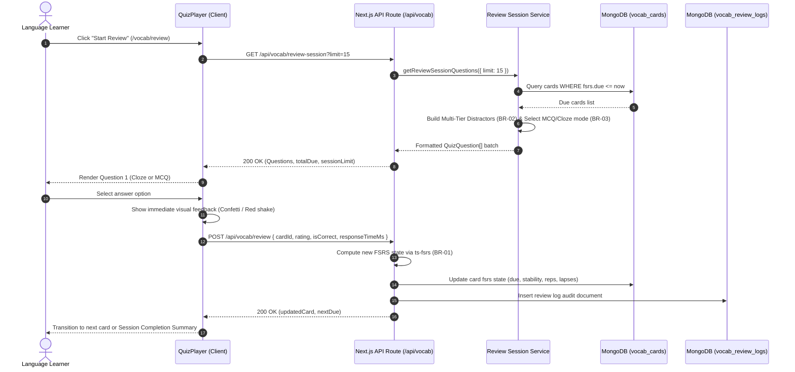
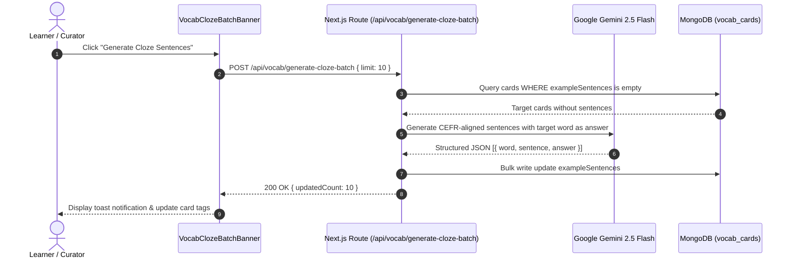
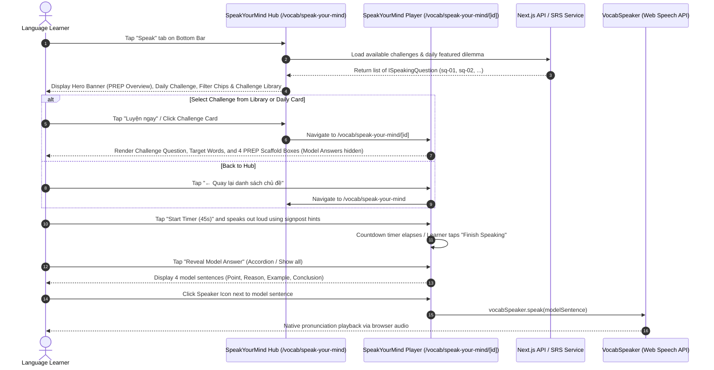

# Module VOCAB — Business Specification

> **Parent Document:** [Requirement Analysis Package](../../README.md)  
> **Module ID:** `VOCAB` | **Domain:** Spaced Repetition Vocabulary & Adaptive Quizzing  
> **Linked Documents:** [API Contract](api-contract.md) | [Acceptance Criteria](acceptance-criteria.md)

---

## 1. Business Objective

Accelerate long-term vocabulary acquisition and prevent forgetting through the modern **Free Spaced Repetition Scheduler (FSRS)**. Provide an adaptive quiz experience that seamlessly evolves from recognition-based **Multiple Choice Questions (MCQ)** to production-based **Contextual Cloze (Fill-in-the-blank)** questions as memory stability strengthens.

---

## 2. Functional Requirements

| FR ID | Feature Description | Actor | Pre-condition | Post-condition | Mapped API Endpoint | Target AC |
|---|---|---|---|---|---|---|
| **FR-VOCAB-01** | Query Due Review Count for Navigation Badge | Learner | App shell rendered | Returns integer count of cards where `due <= now` | [`GET /api/vocab/due-count`](api-contract.md#11-get-apivocabdue-count) | [`AC-VOCAB-01`](acceptance-criteria.md#ac-vocab-01) |
| **FR-VOCAB-02** | Fetch Adaptive Review Session Questions | Learner | `dueCount > 0` or `practiceAll = true` | Returns randomized batch of MCQ/Cloze questions with 4 distinct options | [`GET /api/vocab/review-session`](api-contract.md#12-get-apivocabreview-session) | [`AC-VOCAB-02`](acceptance-criteria.md#ac-vocab-02) |
| **FR-VOCAB-03** | Submit Card Review Rating & Update FSRS State | Learner | Active quiz question completed | Atomic FSRS recalculation, log entry saved, next interval scheduled | [`POST /api/vocab/review`](api-contract.md#13-post-apivocabreview) | [`AC-VOCAB-03`](acceptance-criteria.md#ac-vocab-03) |
| **FR-VOCAB-04** | Batch Generate AI Cloze Example Sentences | Curator | Cards lack example sentences | Gemini AI generates contextual sentences with blanks; card updated | [`POST /api/vocab/generate-cloze-batch`](api-contract.md#14-post-apivocabgenerate-cloze-batch) | [`AC-VOCAB-04`](acceptance-criteria.md#ac-vocab-04) |
| **FR-VOCAB-05** | Stream Word Pronunciation Audio | Learner | Audio icon clicked in card or quiz | Returns binary audio/mpeg from Google TTS or local cache | [`GET /api/vocab/audio`](api-contract.md#15-get-apivocabaudio) | [`AC-VOCAB-05`](acceptance-criteria.md#ac-vocab-05) |
| **FR-VOCAB-06** | Practice Short Speaking via PREP Framework ("Speak Your Mind") | Learner | Speaking question loaded | Renders 4 scaffolded PREP stages with signposts, timer (30-60s), and on-demand model answer reveal | [`GET /api/vocab/speak-your-mind`](api-contract.md#16-get-apivocabspeak-your-mind) | [`AC-VOCAB-06`](acceptance-criteria.md#ac-vocab-06), [`AC-VOCAB-07`](acceptance-criteria.md#ac-vocab-07) |
| **FR-VOCAB-07** | Generate & Stream Dynamic Speaking Quizzes via Agent (`aha-mind-agents`) | Learner / Curator | Storybook or topic selected | Asynchronous job creation, BullMQ queuing, SSE progress stream, and MongoDB question persistence | [`POST /api/agents/speaking-quiz/jobs`](speaking-quiz-api-contract.md#21-kích-hoạt-job-sinh-câu-hỏi-speaking-quiz), [`GET /api/agents/speaking-quiz/jobs/:jobId/progress`](speaking-quiz-api-contract.md#22-lắng-nghe-tiến-trình-thời-gian-thực-qua-sse) | [`AC-VOCAB-08`](acceptance-criteria.md#ac-vocab-08), [`AC-VOCAB-09`](acceptance-criteria.md#ac-vocab-09), [`AC-VOCAB-10`](acceptance-criteria.md#ac-vocab-10) |

---

## 3. User Stories

### US-VOCAB-01: Take Adaptive SRS Review Quiz
- **ID:** `US-VOCAB-01`
- **Actor:** Learner
- **Priority:** Must-have
- **Mapped FR:** [`FR-VOCAB-02`](#2-functional-requirements), [`FR-VOCAB-03`](#2-functional-requirements)
- **Mapped API:** [`GET /api/vocab/review-session`](api-contract.md#12-get-apivocabreview-session), [`POST /api/vocab/review`](api-contract.md#13-post-apivocabreview)
- **Mapped Acceptance Criteria:** [`AC-VOCAB-02`](acceptance-criteria.md#ac-vocab-02), [`AC-VOCAB-03`](acceptance-criteria.md#ac-vocab-03)

**User Story Statement:**
> As an active language learner,  
> I want to review cards scheduled for today using adaptive MCQ and Cloze exercises,  
> So that I can reinforce words right before they fade from memory without being overwhelmed.

#### Sequence Diagram


---

### US-VOCAB-02: Batch Enrich Vocabulary with AI Cloze Sentences
- **ID:** `US-VOCAB-02`
- **Actor:** Curator / Learner
- **Priority:** Should-have
- **Mapped FR:** [`FR-VOCAB-04`](#2-functional-requirements)
- **Mapped API:** [`POST /api/vocab/generate-cloze-batch`](api-contract.md#14-post-apivocabgenerate-cloze-batch)
- **Mapped Acceptance Criteria:** [`AC-VOCAB-04`](acceptance-criteria.md#ac-vocab-04)

**User Story Statement:**
> As a learner expanding my vocabulary,  
> I want the system to automatically generate realistic example sentences with masked blanks using Gemini AI,  
> So that my flashcards qualify for production-oriented Cloze quiz testing.

#### Sequence Diagram


---

### US-VOCAB-03: Practice Short Opinion Speaking (Speak Your Mind)
- **ID:** `US-VOCAB-03`
- **Actor:** Learner
- **Priority:** Must-have
- **Mapped FR:** [`FR-VOCAB-06`](#2-functional-requirements)
- **Mapped Route:** `/vocab/speak-your-mind` (Hub), `/vocab/speak-your-mind/[id]` (Player)
- **Mapped API:** [`GET /api/vocab/speak-your-mind`](api-contract.md#16-get-apivocabspeak-your-mind)
- **Mapped Acceptance Criteria:** [`AC-VOCAB-06`](acceptance-criteria.md#ac-vocab-06), [`AC-VOCAB-07`](acceptance-criteria.md#ac-vocab-07), [`AC-VOCAB-11`](acceptance-criteria.md#ac-vocab-11)

**User Story Statement:**
> As an intermediate learner seeking spoken fluency,  
> I want to access a dedicated Speaking Hub to explore discussion topics, see daily featured challenges, and practice expressing my opinion on a topic in 30–60 seconds guided by the PREP framework in a focused player screen,  
> So that I can overcome hesitation, speak with clear logical structure, and compare my thoughts against a native model answer without navigation disorientation.

#### Sequence Diagram


---

### US-VOCAB-04: Generate Dynamic Speaking Quiz with AI Agent & SSE Progress
- **ID:** `US-VOCAB-04`
- **Actor:** Learner / Content Curator
- **Priority:** Must-have
- **Mapped FR:** [`FR-VOCAB-07`](#2-functional-requirements)
- **Mapped Route:** `/vocab/speak-your-mind/create`
- **Mapped API:** [`POST /api/agents/speaking-quiz/jobs`](speaking-quiz-api-contract.md#21-kích-hoạt-job-sinh-câu-hỏi-speaking-quiz), [`GET /api/agents/speaking-quiz/jobs/:jobId/progress`](speaking-quiz-api-contract.md#22-lắng-nghe-tiến-trình-thời-gian-thực-qua-sse), [`GET /api/agents/speaking-quiz/questions/:id`](speaking-quiz-api-contract.md#24-lấy-chi-tiết-một-câu-hỏi-theo-id), [`GET /api/story-shadowing`](../story-shadowing/api-contract.md)
- **Mapped Acceptance Criteria:** [`AC-VOCAB-08`](acceptance-criteria.md#ac-vocab-08), [`AC-VOCAB-09`](acceptance-criteria.md#ac-vocab-09), [`AC-VOCAB-10`](acceptance-criteria.md#ac-vocab-10), [`AC-VOCAB-12`](acceptance-criteria.md#ac-vocab-12)

**User Story Statement:**
> As an ambitious language learner or content curator,  
> I want to dynamically generate a debate-oriented speaking challenge with a 4-stage PREP scaffold for any Storybook lesson (selected via an intuitive visual search modal rather than raw database IDs) or custom topic using the AI agent, and view real-time pipeline generation progress via a progress bar,  
> So that I can practice authentic critical thinking and speaking without technical friction, waiting blindly, or experiencing HTTP timeout errors.

#### Sequence Diagram
```mermaid
sequenceDiagram
    autonumber
    actor User as Learner / Curator
    participant UI as aha-tools (SpeakingQuizGenerator / SpeakYourMindPlayer)
    participant GW as aha-mind-agents (Gateway Controller)
    participant Redis as Redis Queue (BullMQ) & PubSub
    participant Worker as SpeakingQuiz Worker (LangGraph)
    participant DB as MongoDB (speaking_questions)

    User->>UI: Submit "Generate Speaking Quiz" (storybookId / customTopic, level, keywords)
    UI->>GW: POST /api/agents/speaking-quiz/jobs { storybookId, customTopic, level, targetKeywords, forceRegenerate }
    
    alt Idempotent Cache Hit (BR-09: Pre-existing question for storybookId & forceRegenerate=false)
        GW->>DB: Check existing question by storybookId
        DB-->>GW: Existing question record found
        GW-->>UI: 202 Accepted { jobId: "existing-...", status: "completed", existingQuestionId }
        UI->>GW: GET /api/agents/speaking-quiz/questions/:existingQuestionId
        GW-->>UI: 200 OK (Full question details & PREP scaffold < 50ms)
        UI-->>User: Render SpeakYourMindPlayer immediately
    else Cold Generation / Force Regenerate
        GW->>Redis: Enqueue job into 'speaking-quiz-queue'
        GW-->>UI: 202 Accepted { jobId, status: "queued", sseUrl }
        
        UI->>GW: GET /api/agents/speaking-quiz/jobs/:jobId/progress (Accept: text/event-stream)
        Worker->>Redis: Dequeue Job & execute LangGraph StateGraph
        
        Worker->>Redis: Publish stepName="context_resolved" (25%)
        Redis-->>GW-->>UI: SSE Data: { progress: 25, stepName: "context_resolved" }
        UI-->>User: Update Progress Bar: "Context resolved successfully (25%)"
        
        Worker->>Redis: Publish stepName="question_formulated" (50%)
        Redis-->>GW-->>UI: SSE Data: { progress: 50, stepName: "question_formulated" }
        UI-->>User: Update Progress Bar: "Debate question formulated (50%)"
        
        Worker->>Redis: Publish stepName="prep_synthesized" (80%)
        Redis-->>GW-->>UI: SSE Data: { progress: 80, stepName: "prep_synthesized" }
        UI-->>User: Update Progress Bar: "PREP scaffold synthesized (80%)"
        
        Worker->>DB: Insert SpeakingQuestion record into MongoDB
        Worker->>Redis: Publish status="done", progress=100 with payload.questionId
        Redis-->>GW-->>UI: SSE Data: { status: "done", progress: 100, payload: { questionId, ... } }
        UI->>UI: Close SSE connection (eventSource.close())
        
        UI->>GW: GET /api/agents/speaking-quiz/questions/:questionId
        GW-->>UI: 200 OK (Full SpeakingQuestionDetail)
        UI-->>User: Transition from Generator progress to active SpeakYourMindPlayer
    end
```

---

*Made by Anh Tu - Share to be share*
