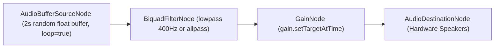

# Module WHITE-NOISE — Client Service Contract & Hook Schemas

> **Parent Document:** [Module Spec](spec.md) | [Requirement Analysis Package](../../README.md)  
> **Module ID:** `NOISE` | **Scope:** Client-Side Web Audio API Synthesis Contracts  
> **Linked Documents:** [Acceptance Criteria](acceptance-criteria.md)

---

## 1. Client Contract Specifications

> [!NOTE]
> In accordance with [`BR-07`](../../global/business-rules.md#br-07) and [`ADR-004`](../../governance/adr/004-web-audio-api-synthesis.md), the White Noise engine is executed **entirely on the client browser** using the Web Audio API without backend network HTTP requests. This document specifies the TypeScript interfaces and contracts governing client sound synthesis.

---

### 1.1 Hook Interface: `useNoiseGenerator`
- **Mapped Requirements:** [`FR-NOISE-01`](spec.md#2-functional-requirements), [`FR-NOISE-02`](spec.md#2-functional-requirements), [`FR-NOISE-03`](spec.md#2-functional-requirements)
- **File Reference:** `src/app/apps/white-noise/useNoiseGenerator.ts`

```typescript
export interface UseNoiseGeneratorReturn {
  /** Boolean indicating whether audio buffer is actively looping */
  isPlaying: boolean;

  /** Toggles audio playback state; initializes AudioContext on first invocation */
  toggle: () => void;

  /** Current volume level bounded between 0 and 100 */
  volume: number;

  /** Smoothly adjusts gainNode using exponential time constant ramp */
  setVolume: (volume: number) => void;

  /** Current audio spectral profile: 'white' (flat) or 'brown' (400Hz lowpass) */
  noiseType: "white" | "brown";

  /** Modulates biquad filter node type in real time */
  setNoiseType: (type: "white" | "brown") => void;
}
```

---

### 1.2 Web Audio Node Graph Topology
The synthesis pipeline connects audio nodes in the following strict topology:



* **Sample Rate:** `audioContext.sampleRate` (typically $44.1\text{ kHz}$ or $48\text{ kHz}$).
* **Buffer Size:** `sampleRate * 2` (2 seconds of audio data).
* **Sample Values:** Uniform stochastic distribution $x \in [-1.0, 1.0]$.
* **De-pop Transition Constant:** `timeConstant = 0.015s` (15 milliseconds exponential decay).

---

### 1.3 Component Contract: `SettingsDrawer`
- **Mapped Requirement:** [`FR-NOISE-04`](spec.md#2-functional-requirements)
- **File Reference:** `src/app/apps/white-noise/components/SettingsDrawer.tsx`

```typescript
export interface SettingsDrawerProps {
  /** Duration in minutes before audio context automatically pauses (0 = disabled) */
  timerMinutes: number;
  onTimerChange: (minutes: number) => void;
  isOpen: boolean;
  onOpenChange: (open: boolean) => void;
}
```

---

*Made by Anh Tu - Share to be share*
