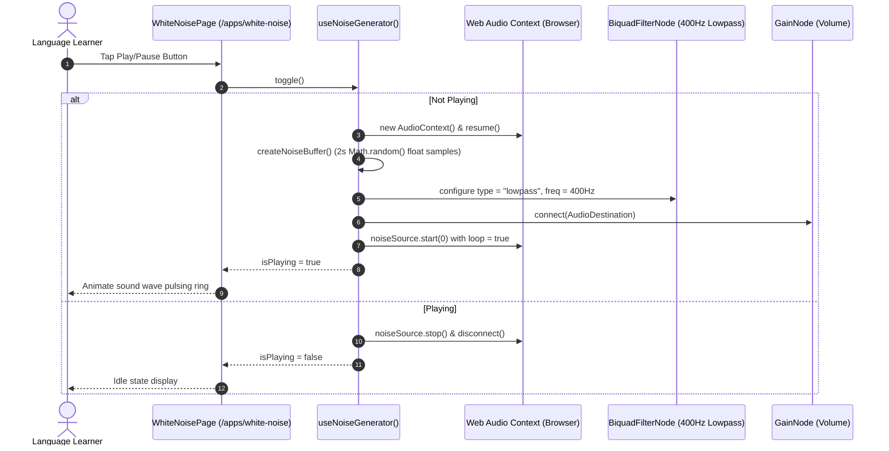
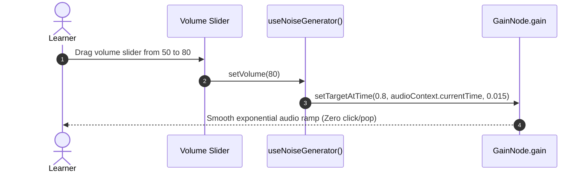

# Module WHITE-NOISE — Business Specification

> **Parent Document:** [Requirement Analysis Package](../../README.md)  
> **Module ID:** `NOISE` | **Domain:** Procedural Soundscape & Focus Audio Generation  
> **Linked Documents:** [API Contract](api-contract.md) | [Acceptance Criteria](acceptance-criteria.md)

---

## 1. Business Objective

Deliver an instantaneous, distraction-free study environment by generating **stochastic acoustic masking (White & Brown Noise)** directly inside the user's browser. Eliminate streaming audio costs, loop stutters, and subscriptions by leveraging the **Web Audio API** to compute sound waves mathematically in real time ([`BR-07`](../../global/business-rules.md#br-07)).

---

## 2. Functional Requirements

| FR ID | Feature Description | Actor | Pre-condition | Post-condition | Mapped API / Hook Contract | Target AC |
|---|---|---|---|---|---|---|
| **FR-NOISE-01** | Start / Stop Procedural Sound Synthesis | Learner | User clicks play toggle | Synthesizes buffer, loops audio, updates `isPlaying` state | [`useNoiseGenerator.toggle()`](api-contract.md#11-hook-interface-usenoisegenerator) | [`AC-NOISE-01`](acceptance-criteria.md#ac-noise-01) |
| **FR-NOISE-02** | Select Noise Spectrum (White vs. Brown) | Learner | Noise generator active | Reconfigures `BiquadFilterNode` frequency without interruption | [`useNoiseGenerator.setNoiseType()`](api-contract.md#11-hook-interface-usenoisegenerator) | [`AC-NOISE-02`](acceptance-criteria.md#ac-noise-02) |
| **FR-NOISE-03** | Smooth Volume Modulation (De-popping) | Learner | Volume slider moved | Applies exponential ramp via `setTargetAtTime` to avoid click/pop | [`useNoiseGenerator.setVolume()`](api-contract.md#11-hook-interface-usenoisegenerator) | [`AC-NOISE-03`](acceptance-criteria.md#ac-noise-03) |
| **FR-NOISE-04** | Configure Sleep / Focus Countdown Timer | Learner | Noise playing | Automatically mutes and closes `AudioContext` upon timer expiry | [`SettingsDrawer.onTimerExpire()`](api-contract.md#12-component-contract-settingsdrawer) | [`AC-NOISE-04`](acceptance-criteria.md#ac-noise-04) |

---

## 3. User Stories

### US-NOISE-01: Toggle Procedural Brown Noise for Focused Study
- **ID:** `US-NOISE-01`
- **Actor:** Learner
- **Priority:** Must-have
- **Mapped FR:** [`FR-NOISE-01`](#2-functional-requirements), [`FR-NOISE-02`](#2-functional-requirements)
- **Mapped Contract:** [`useNoiseGenerator.toggle()`](api-contract.md#11-hook-interface-usenoisegenerator)
- **Mapped Acceptance Criteria:** [`AC-NOISE-01`](acceptance-criteria.md#ac-noise-01), [`AC-NOISE-02`](acceptance-criteria.md#ac-noise-02)

**User Story Statement:**
> As a student studying in a noisy environment,  
> I want to instantly turn on continuous Brown Noise with a single tap,  
> So that ambient distractions are masked without consuming my mobile data or stalling due to network buffering.

#### Sequence Diagram

---

### US-NOISE-02: De-popped Smooth Volume Adjustment
- **ID:** `US-NOISE-02`
- **Actor:** Learner
- **Priority:** Should-have
- **Mapped FR:** [`FR-NOISE-03`](#2-functional-requirements)
- **Mapped Contract:** [`useNoiseGenerator.setVolume()`](api-contract.md#11-hook-interface-usenoisegenerator)
- **Mapped Acceptance Criteria:** [`AC-NOISE-03`](acceptance-criteria.md#ac-noise-03)

**User Story Statement:**
> As an audio-sensitive learner,  
> I want adjusting the volume slider to transition smoothly without crackling or clicking sounds,  
> So that my concentration is not interrupted by abrupt acoustic artifacts.

#### Sequence Diagram

---

*Made by Anh Tu - Share to be share*
