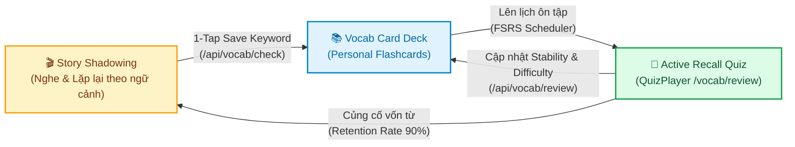
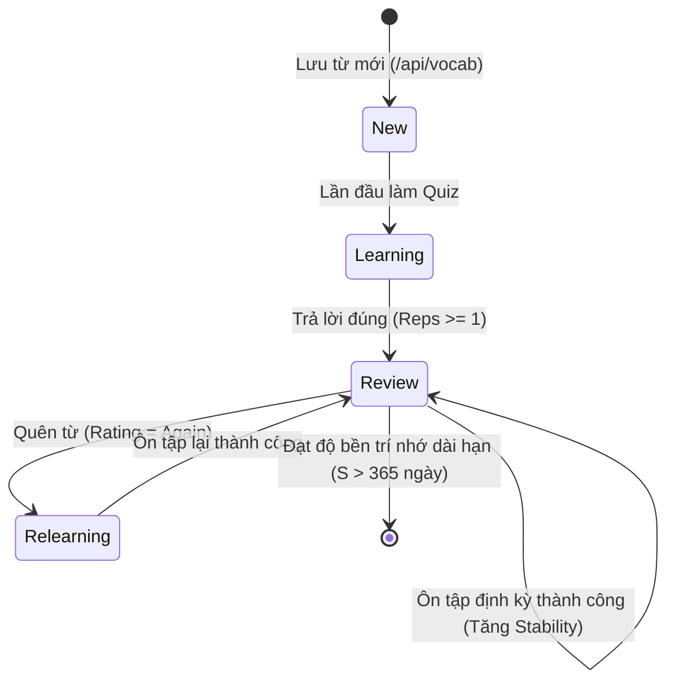
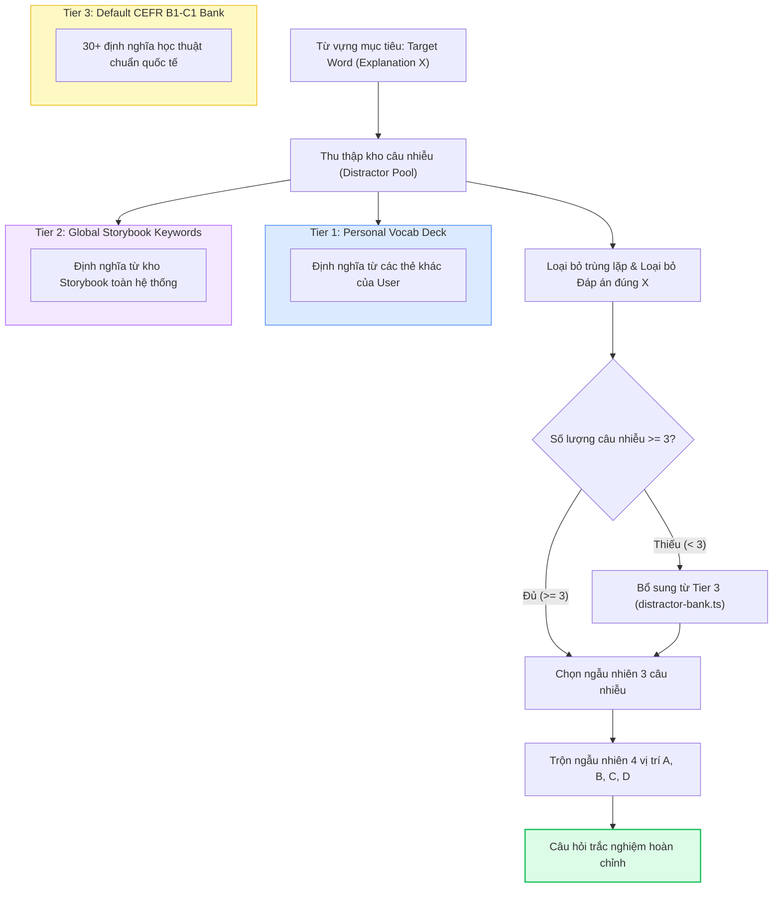
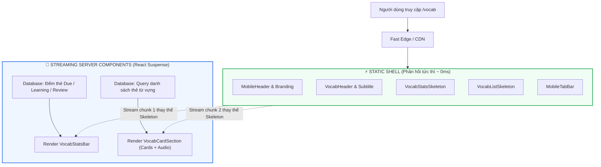
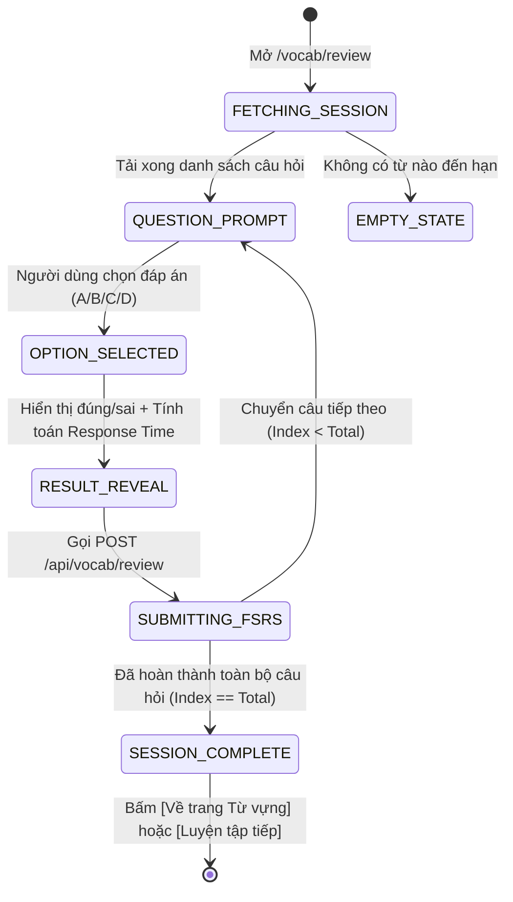
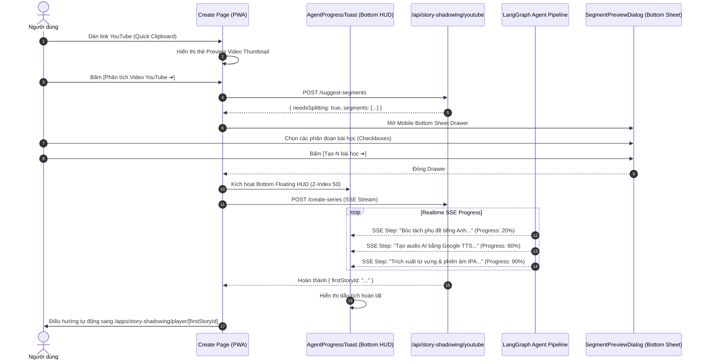

# AI Story Shadowing & Vocab SRS — System Design

> **Tài liệu kiến trúc hệ thống tổng thể (Living Document)**
> Thiết kế và hệ thống hóa kiến trúc nền tảng Micro-Apps học tiếng Anh thông minh: **Story Shadowing** kết hợp **Spaced Repetition Vocab Engine (FSRS-4.5)** trên nền tảng **Next.js 16 Partial Prerendering (PPR)** và **PWA Mobile-First**.

---

## 1. Mục tiêu Sản phẩm & Hệ Sinh Thái Học Tập (Product Goal & Ecosystem)

Hệ sinh thái **AHA English Tools** được xây dựng nhằm giải quyết triệt để 2 bài toán lớn nhất của người học ngoại ngữ:
1. **Phản xạ Nghe — Nói (Spoken Fluency):** Tiếp thu ngôn ngữ tự nhiên thông qua kỹ thuật **Shadowing** từ Video YouTube thực tế, bài báo hoặc văn bản bất kỳ.
2. **Ghi nhớ Dài hạn (Long-Term Retention):** Khắc phục "Đường cong quên lãng" (Ebbinghaus Forgetting Curve) bằng hệ thống **Spaced Repetition (SRS)** ứng dụng thuật toán khoa học hiện đại **FSRS-4.5**.



### 1.1 Definition Anatomy (Giải Phẫu Khái Niệm Cốt Lõi)

#### A. Shadowing Technique (Kỹ thuật Shadowing)
> **Định nghĩa chuẩn:** Shadowing là một kỹ thuật luyện tập ngôn ngữ nâng cao trong đó người học lắng nghe một đoạn âm thanh mẫu từ người bản xứ và lặp lại (nhại lại) gần như đồng thời hoặc ngay trong khoảng dừng ngắn, mô phỏng chính xác ngữ điệu, trọng âm, nối âm và tốc độ nói.

**Giải phẫu từ khóa cấu thành:**
- **Shadow (Chiếc bóng):** Người học đóng vai trò như chiếc bóng của người nói, không dừng lại để dịch nghĩa mà bám sát luồng âm thanh để hình thành phản xạ cơ miệng.
- **Immediate Repetition (Lặp lại tức thì):** Kích hoạt trí nhớ làm việc (Working Memory) và vùng điều khiển vận động ngôn ngữ (Broca's area) trong não bộ.
- **Prosody Matching (Mô phỏng ngữ điệu):** Học cách nhấn nhá (Intonation), trọng âm câu (Sentence Stress) và nối từ tự nhiên thay vì phát âm từng từ rời rạc.

#### B. Spaced Repetition System — SRS (Hệ thống Ôn tập Ngắt quãng)
> **Định nghĩa chuẩn:** SRS là phương pháp ghi nhớ dựa trên bằng chứng khoa học (Evidence-based learning), trong đó khoảng thời gian giữa các lần ôn tập một đơn vị kiến thức (thẻ từ vựng) được tăng dần theo cấp số nhân dựa trên độ khó và khả năng truy hồi của người học.

**Giải phẫu từ khóa cấu thành:**
- **Spaced (Ngắt quãng theo thời gian):** Trái ngược với nhồi nhét (Cramming), việc ngắt quãng buộc não bộ phải nỗ lực truy hồi thông tin ngay trước thời điểm sắp quên (Optimal Review Time).
- **Repetition (Lặp lại chủ động - Active Recall):** Đòi hỏi người học phải tự nhớ lại định nghĩa trước khi nhìn thấy đáp án, củng cố các liên kết synapse thần kinh.
- **System (Hệ thống điều phối tự động):** Thuật toán máy tính tính toán chính xác ngày tới hạn (Due Date) cho từng từ mà không cần người học tự ghi nhớ lịch trình.

#### C. Free Spaced Repetition Scheduler — FSRS-4.5
> **Định nghĩa chuẩn:** FSRS là thuật toán lập lịch ôn tập ngắt quãng thế hệ mới dựa trên mô hình toán học DSR (Difficulty - Stability - Retrievability), tối ưu hóa đường cong suy giảm trí nhớ dựa trên dữ liệu học tập thực tế, vượt trội hơn thuật toán cổ điển SM-2 (SuperMemo-2 / Anki cũ).

**Giải phẫu từ khóa cấu thành:**
- **Difficulty ($D \in [1, 10]$):** Độ khó nội tại của từ vựng đối với cá nhân người học.
- **Stability ($S \ge 0$ ngày):** Độ bền trí nhớ — khoảng thời gian cần thiết để xác suất nhớ lại ($R$) giảm từ 100% xuống $90\%$.
- **Retrievability ($R(t) = (1 + F \cdot \frac{t}{S})^{-w}$):** Xác suất truy hồi thành công thông tin tại thời điểm $t$ ngày sau lần ôn tập gần nhất.

---

## 2. Bảng Phân Tầng Công Nghệ (Tech Stack)

| Layer | Technology | Vai trò & Điểm nổi bật |
| :--- | :--- | :--- |
| **Frontend Framework** | **Next.js 16 (App Router) + React 19** | Hỗ trợ Server Actions, Server Components, `useTransition` |
| **Rendering Strategy** | **Partial Prerendering (PPR) + Suspense** | Prerender Static Shell tức thì, Stream dữ liệu động qua React Suspense |
| **SRS Algorithm** | **FSRS-4.5 (`ts-fsrs@^4.4`)** | Thuật toán DSR lập lịch ôn tập từ vựng ngắt quãng khoa học |
| **Distractor Engine** | **Multi-Tier Pool (`distractor-bank.ts`)** | Tự động trích xuất & sinh 3 câu nhiễu trắc nghiệm thông minh |
| **PWA & Offline** | **Manifest (`manifest.ts`) + SW (`sw.js`)** | Standalone mode, App shortcuts, Caching static assets, Safe area |
| **Brand & Assets System** | **`brand.ts` + Sharp Asset Pipeline** | Single Source of Truth cho nhận diện thương hiệu, sinh icon maskable |
| **App Shell & Layout** | **Mobile-First Shell (`max-w-[480px]`)** | Tối ưu công thái học ngón cái (Thumb-Zone), Bottom Sheet, Floating HUD |
| **Styling & Theme** | **TailwindCSS v4 + Dark Mode** | Bảng màu HSL hài hòa (Slate & Amber `#FFBA49`), Safe-area insets |
| **AI Orchestration** | **LangGraph (`@langchain/langgraph`)** | State Graph đa bước bóc tách phụ đề, tách câu, phiên âm IPA, trích xuất từ vựng |
| **AI LLM Model** | **Gemini 2.5 Flash** | Model tốc độ cao xử lý phân đoạn YouTube, đánh giá độ khó, IPA ngữ cảnh |
| **TTS Service** | **Google Cloud TTS REST API** | Giọng đọc tự nhiên chất lượng cao (`Journey`, `Neural2`, `Standard`) |
| **Media Player** | **`react-youtube` + Web Audio API** | Đồng bộ Timestamp YouTube chính xác và audio TTS base64 |
| **Database** | **MongoDB (Mongoose ODM)** | Lưu trữ `storybooks`, `vocab_cards`, `vocab_review_logs` |
| **Validation & Schema** | **Zod v4** | Type-safe runtime validation cho API inputs, LLM outputs, FSRS payloads |
| **Realtime Streaming** | **Server-Sent Events (SSE)** | Stream tiến trình Agent từng bước về giao diện người dùng |

---

## 3. Kiến trúc Tổng thể Hệ thống (High-Level Architecture)

```mermaid
flowchart TD
    subgraph ClientLayer ["📱 CLIENT LAYER — PWA MOBILE SHELL (max-w-480px)"]
        direction TB
        AppShell["Mobile AppShell"]
        MobileHeader["Sticky Header (Logo / Back)"]
        MobileTabBar["4-Tab Bottom Navigation (Home | Story | Vocab | Profile)"]
        
        subgraph Views ["Màn hình chức năng"]
            HomeView["/ (Dashboard & Due Cards)"]
            StoryListView["/apps/story-shadowing (PPR Story List)"]
            CreateStoryView["/apps/story-shadowing/create (YouTube / URL / Text)"]
            PlayerView["/apps/story-shadowing/player/[id] (TTS & YouTube Player)"]
            VocabListView["/vocab (PPR Flashcards & Stats)"]
            QuizPlayerView["/vocab/review (Interactive MCQ Quiz Player)"]
        end

        subgraph FloatingComponents ["Overlay & Interactive Drawers"]
            HUDToast["AgentProgressToast (Bottom Floating HUD)"]
            SegmentDrawer["SegmentPreviewDialog (Bottom Sheet Drawer)"]
        end
    end

    subgraph NextServerLayer ["⚡ NEXT.JS 16 SERVER & PPR LAYER"]
        direction TB
        PPR_Engine["Partial Prerendering Engine (Static Shell + Dynamic Streaming)"]
        
        subgraph APIRoutes ["REST & SSE API Routes"]
            APIShadowing["/api/story-shadowing/*<br/>(process, scrape, youtube, create-series)"]
            APIVocab["/api/vocab/*<br/>(check, due-count, review-session, review)"]
        end
    end

    subgraph DomainServices ["🧠 DOMAIN SERVICES & AI LAYER"]
        direction TB
        LangGraph["LangGraph Workflow Pipelines (Story & YouTube State Graphs)"]
        FSRSEngine["FSRS-4.5 Scheduler Engine (ts-fsrs)"]
        DistractorEngine["Multi-Tier Distractor Generation Engine"]
        Readability["@mozilla/readability Web Scraper"]
    end

    subgraph ExternalServices ["🌐 EXTERNAL CLOUD SERVICES"]
        direction TB
        Gemini["Google Gemini 2.5 Flash API"]
        GoogleTTS["Google Cloud TTS REST API"]
        YouTubeCC["YouTube Transcript Service"]
    end

    subgraph DatabaseLayer ["🗄️ DATABASE LAYER (MongoDB)"]
        direction TB
        DB_Story["Collection: storybooks (Storybook_v5)"]
        DB_Vocab["Collection: vocab_cards (VocabCard_v1)"]
        DB_Logs["Collection: vocab_review_logs (VocabReviewLog_v1)"]
    end

    %% Flow connections
    AppShell --> MobileHeader
    AppShell --> Views
    AppShell --> MobileTabBar
    CreateStoryView -.-> HUDToast
    CreateStoryView -.-> SegmentDrawer

    Views --> PPR_Engine
    PPR_Engine --> APIRoutes
    
    APIShadowing --> LangGraph
    APIShadowing --> Readability
    APIVocab --> FSRSEngine
    APIVocab --> DistractorEngine

    LangGraph --> Gemini
    LangGraph --> GoogleTTS
    LangGraph --> YouTubeCC

    APIShadowing --> DB_Story
    APIVocab --> DB_Vocab
    APIVocab --> DB_Logs
    DistractorEngine --> DB_Story
    DistractorEngine --> DB_Vocab

    style ClientLayer fill:#f8fafc,stroke:#94a3b8,stroke-width:2px
    style NextServerLayer fill:#eff6ff,stroke:#3b82f6,stroke-width:2px
    style DomainServices fill:#fdf4ff,stroke:#c084fc,stroke-width:2px
    style ExternalServices fill:#fffbeb,stroke:#f59e0b,stroke-width:2px
    style DatabaseLayer fill:#f0fdf4,stroke:#22c55e,stroke-width:2px
```



---

## 4. Sơ đồ Cấu trúc Thư mục Mã nguồn (File Structure Map)

```
src/
├── app/
│   ├── layout.tsx                          ← Root Layout (AppShell, Brand Metadata, Service Worker, Toasts)
│   ├── page.tsx                            ← [PPR] Smart Dashboard (Due Card, Shortcuts, Recent Stories)
│   ├── globals.css                         ← Tailwind v4 tokens, Glassmorphism, Safe-area insets
│   ├── manifest.ts                         ← [PWA] Web App Manifest (Standalone, Icons, Colors)
│   │
│   ├── vocab/
│   │   ├── page.tsx                        ← [PPR] Vocab Dashboard (Suspense Streaming: Stats + Cards)
│   │   └── review/
│   │       ├── page.tsx                    ← [SSR/Client] Interactive SRS Quiz Review Session
│   │       └── loading.tsx                 ← Quiz Skeleton UI trong lúc fetch câu hỏi
│   │
│   ├── profile/
│   │   └── page.tsx                        ← [PWA] User Settings (Voice, Theme, Spaced Repetition Prefs)
│   │
│   ├── apps/
│   │   ├── opta/                           ← Micro-App: Football Analytics
│   │   ├── white-noise/                    ← Micro-App: White Noise Ambient Audio
│   │   └── story-shadowing/
│   │       ├── page.tsx                    ← [PPR] Story History (Streaming StoryListContainer)
│   │       ├── layout.tsx
│   │       ├── create/
│   │       │   └── page.tsx                ← [PWA] Create Page (YouTube/URL/Text + Sticky Submit)
│   │       ├── player/
│   │       │   └── [id]/
│   │       │       └── page.tsx            ← [PWA] Full-Screen Shadowing Player (TabBar Hidden)
│   │       └── design/
│   │           └── SYSTEM_DESIGN.md        ← Living Architecture Document
│   │
│   └── api/
│       ├── story-shadowing/
│       │   ├── route.ts                    ← GET: Danh sách bài học Storybook
│       │   ├── [id]/route.ts               ← GET/DELETE: Chi tiết bài học
│       │   ├── process/route.ts            ← POST: Text Input → LangGraph TTS Pipeline (SSE Stream)
│       │   ├── scrape/route.ts             ← GET: Article URL → Readability Extraction
│       │   ├── series/[seriesId]/route.ts  ← GET: Danh sách các bài trong cùng 1 Series YouTube
│       │   └── youtube/
│       │       ├── route.ts                ← POST: YouTube Single Story Pipeline (SSE Stream)
│       │       ├── suggest-segments/route.ts ← POST: Phân tích video dài & chia segment
│       │       └── create-series/route.ts  ← POST: Tạo chuỗi bài học hàng loạt từ Video dài (SSE)
│       └── vocab/
│           ├── route.ts                    ← GET (Filter/Search) / POST (Save VocabCard)
│           ├── [id]/route.ts               ← GET/PUT/DELETE: Thẻ từ vựng cá nhân
│           ├── check/route.ts              ← GET: Kiểm tra từ đã được lưu trong SRS hay chưa
│           ├── due-count/route.ts          ← GET: Đếm số lượng thẻ đến hạn ôn tập hôm nay
│           ├── review/route.ts             ← POST: Nộp kết quả Quiz & tính toán FSRS Scheduler
│           └── review-session/route.ts     ← GET: Tạo đề trắc nghiệm (Multi-Tier Distractor Pool)
│
├── components/
│   ├── mobile-shell/                       ← PWA App Shell Framework
│   │   ├── app-shell.tsx                   ← Mobile wrapper 480px + safe-area insets
│   │   ├── mobile-header.tsx               ← Header tối giản + Back button logic
│   │   ├── mobile-tab-bar.tsx              ← 4-Tab Bottom Bar (Tự động ẩn trên Player & Create)
│   │   └── pwa-register.tsx                ← Client Service Worker auto-register
│   │
│   ├── dashboard/
│   │   └── due-review-card.tsx             ← Widget thông báo số từ đến hạn ôn tập kèm CTA
│   │
│   ├── story-shadowing/                    ← Các thành phần Story Shadowing
│   │   ├── StoryCard.tsx                   ← Card bài học đơn lẻ (Thumbnail, Level, Date)
│   │   ├── StorySeriesCard.tsx             ← Card chuỗi bài học YouTube nhiều phần
│   │   ├── StoryListContainer.tsx          ← Container hỗ trợ PPR Streaming + Client Filter
│   │   ├── StoryListSkeleton.tsx           ← Loading Skeleton cho Story List
│   │   ├── StorybookHeader.tsx             ← Tiêu đề & Nút Tạo bài học
│   │   ├── shadowing-player.tsx            ← Player điều khiển TTS Audio
│   │   ├── sentence-card.tsx               ← Hiển thị câu + Phiên âm Ruby IPA
│   │   ├── vocab-card.tsx                  ← Card từ vựng then chốt + Nút Lưu vào SRS 1-Chạm
│   │   ├── segment-preview-dialog.tsx      ← Mobile Bottom Sheet Drawer chia nhỏ video dài
│   │   └── agent-progress-toast.tsx        ← Floating Bottom HUD hiển thị tiến trình AI
│   │
│   └── vocab/                              ← Các thành phần Vocab SRS
│       ├── VocabHeader.tsx                 ← Tiêu đề + Nút Ôn tập nhanh
│       ├── VocabStatsBar.tsx               ← Thống kê thẻ: Due, Learning, Review, Total
│       ├── VocabStatsSkeleton.tsx          ← Skeleton cho Stats Bar
│       ├── VocabSearchFilter.tsx           ← Ô tìm kiếm từ vựng + Filter Tabs (All/Due/Learning/Review)
│       ├── VocabCardItem.tsx               ← Thẻ từ vựng (Word, IPA, Level, FSRS Due Badge, Audio)
│       ├── VocabCardSection.tsx            ← Danh sách thẻ từ vựng phân trang / search
│       ├── VocabListSkeleton.tsx           ← Skeleton cho danh sách thẻ từ vựng
│       └── review/
│           ├── QuizPlayer.tsx              ← Giao diện làm bài trắc nghiệm + Animation chấm điểm
│           └── QuizSkeleton.tsx            ← Skeleton cho Quiz Player
│
├── lib/
│   ├── config/
│   │   └── brand.ts                        ← Single Source of Truth cho Brand Assets & Info
│   │
│   ├── srs/                                ← Module Spaced Repetition System
│   │   ├── fsrs-engine.ts                  ← Cấu hình FSRS Scheduler + Mapping Grade
│   │   ├── review-session.service.ts       ← Service tạo đề thi trắc nghiệm (Multi-Tier Pool)
│   │   └── distractor-bank.ts              ← Ngân hàng câu nhiễu mặc định chuẩn CEFR B1-C1
│   │
│   ├── db/
│   │   ├── mongoose.ts                     ← MongoDB Connection Manager
│   │   └── models/
│   │       ├── Storybook.ts                ← Model: `Storybook_v5`
│   │       ├── VocabCard.ts                ← Model: `VocabCard_v1`
│   │       └── VocabReviewLog.ts           ← Model: `VocabReviewLog_v1`
│   │
│   ├── agents/story-shadowing-agent/       ← LangGraph AI Workflows
│   │   ├── state.ts / graph.ts             ← Text Shadowing State Pipeline
│   │   ├── youtube-state.ts / youtube-graph.ts ← YouTube Shadowing Pipeline
│   │   └── nodes/                          ← Các Node xử lý (Splitter, TTS, Keywords, IPA)
│   │
│   └── hooks/
│       ├── use-settings.ts                 ← LocalStorage User Preferences
│       ├── use-shadowing-player.ts         ← TTS Player State Machine
│       └── useYouTubeShadowingPlayer.ts    ← YouTube Player Controller & Synchronizer
│
└── scripts/
    └── generate-brand-assets.mjs           ← Pipeline tạo tự động toàn bộ Icon/Splash PWA từ SVG
```

---

## 5. Mô Hình Dữ Liệu Chi Tiết (MongoDB Schemas)

### 5.1 Collection `storybooks` (Model: `Storybook_v5`)

Lưu trữ kịch bản bài luyện Shadowing tạo từ Text hoặc YouTube Video:

```typescript
interface IStorybookSentence {
  id: number;
  text: string;
  audioBase64?: string;                     // File âm thanh TTS nén Base64
  words?: { word: string; ipa: string }[];  // Phiên âm IPA từng từ phục vụ Ruby tag
  startMs?: number;                         // Timestamp bắt đầu trên YouTube (ms)
  endMs?: number;                           // Timestamp kết thúc trên YouTube (ms)
}

interface IStorybookKeyword {
  word: string;
  ipa?: string;
  explanation: string;
  level: "easy" | "medium" | "hard";
  wordFamily?: {
    word: string;
    partOfSpeech?: string;
    ipa?: string;
    explanation: string;
  }[];
  collocations?: {
    collocation: string;
    explanation: string;
  }[];
}

interface IStorybook {
  title: string;
  thumbnail?: string;
  originalText: string;
  level: "easy" | "medium" | "hard";
  voice: string;                            // Google Cloud TTS Voice ID
  speakingRate: number;
  sourceType: "text" | "youtube";
  youtubeVideoId?: string;
  
  sentences: IStorybookSentence[];
  keywords?: IStorybookKeyword[];

  // Series Metadata (cho Video YouTube dài được chia nhỏ)
  seriesId?: string;                        // UUID định danh chuỗi bài học
  partIndex?: number;                       // Số thứ tự tập (0, 1, 2,...)
  partTitle?: string;                       // Tiêu đề phân đoạn
  totalParts?: number;                      // Tổng số tập trong series

  createdAt: Date;
  updatedAt: Date;
}
```

---

### 5.2 Collection `vocab_cards` (Model: `VocabCard_v1`)

Thẻ từ vựng cá nhân được lưu vào bộ nhớ Spaced Repetition từ bài học Shadowing:

```typescript
import { State as FSRSState } from "ts-fsrs";

interface IFSRSCardState {
  due: Date;                                // Ngày/giờ đến hạn ôn tập tiếp theo (Indexed)
  stability: number;                        // Độ bền trí nhớ (S tính theo ngày)
  difficulty: number;                       // Độ khó nội tại (D: 1 -> 10)
  elapsed_days: number;                     // Số ngày trôi qua kể từ lần ôn tập trước
  scheduled_days: number;                   // Khoảng cách ngày đã được lập lịch
  reps: number;                             // Tổng số lượt đã ôn tập thành công
  lapses: number;                           // Số lần bị quên (đánh giá Again)
  state: FSRSState;                         // 0: New, 1: Learning, 2: Review, 3: Relearning
  last_review?: Date;                       // Thời điểm ôn tập gần nhất
}

interface IVocabCard {
  word: string;                             // Từ vựng (Indexed)
  ipa?: string;                             // Phiên âm quốc tế
  explanation: string;                      // Định nghĩa ngắn gọn dễ hiểu
  level: "A1" | "A2" | "B1" | "B2" | "C1" | "C2";
  wordFamily?: {
    word: string;
    partOfSpeech?: string;
    ipa?: string;
    explanation: string;
  }[];
  collocations?: {
    collocation: string;
    explanation: string;
  }[];
  
  sourceStorybookId?: Types.ObjectId;       // Liên kết ngược về bài Storybook gốc
  sourceStorybookTitle?: string;            // Tiêu đề bài học gốc để gợi nhớ ngữ cảnh
  
  fsrs: IFSRSCardState;                     // Trạng thái thuật toán FSRS

  createdAt: Date;
  updatedAt: Date;
}
```

---

### 5.3 Collection `vocab_review_logs` (Model: `VocabReviewLog_v1`)

Nhật ký ghi vết toàn bộ lịch sử trả lời Quiz phục vụ thống kê và tối ưu tham số FSRS:

```typescript
interface IVocabReviewLog {
  cardId: Types.ObjectId;                   // ID thẻ từ vựng (Indexed)
  rating: 1 | 2 | 3 | 4;                    // 1: Again, 2: Hard, 3: Good, 4: Easy
  state: FSRSState;                         // Trạng thái thẻ tại thời điểm review
  due: Date;                                // Ngày đáo hạn mới được tính ra
  stability: number;                        // Độ ổn định mới
  difficulty: number;                       // Độ khó mới
  elapsed_days: number;
  last_elapsed_days: number;
  scheduled_days: number;
  review: Date;                             // Thời điểm làm bài kiểm tra (Indexed)
  responseTimeMs?: number;                  // Độ trễ phản xạ trả lời (ms)
}
```

---

## 6. Kiến Trúc Thuật Toán FSRS-4.5 & Spaced Repetition

### 6.1 Vòng Đời Trạng Thái Thẻ Từ Vựng (Card State Lifecycle)



### 6.2 Cơ Chế Ánh Xạ Độ Trễ Phản Xạ (Response Latency) Sang FSRS Rating

Thay vì bắt người dùng tự đánh giá chủ quan ("Tôi thấy từ này dễ hay khó?"), hệ thống tự động suy luận mức độ ghi nhớ (**Grade**) dựa trên **tính chính xác** và **tốc độ phản xạ** trong bài trắc nghiệm:

```typescript
export function calculateFSRSRating(isCorrect: boolean, responseTimeMs: number): Grade {
  // 1. Trả lời sai -> Buộc phải học lại
  if (!isCorrect) {
    return Rating.Again; // 1
  }

  // 2. Trả lời đúng nhưng do dự lâu (> 10 giây) -> Trí nhớ yếu
  if (responseTimeMs > 10000) {
    return Rating.Hard;  // 2
  }

  // 3. Trả lời đúng trong thời gian bình thường (3s - 10s) -> Đạt yêu cầu
  if (responseTimeMs >= 3000) {
    return Rating.Good;  // 3
  }

  // 4. Phản xạ tức thì (< 3 giây) -> Khắc sâu trong tiềm thức
  return Rating.Easy;    // 4
}
```

---

## 7. Kiến Trúc Multi-Tier Distractor Engine

Để tạo ra một bài trắc nghiệm 4 lựa chọn ($1 \text{ đáp án đúng} + 3 \text{ câu nhiễu}$) chuẩn sư phạm và có tính thử thách cao, hệ thống sử dụng kiến trúc **3 tầng gom câu nhiễu**:



**Ưu điểm vượt trội:**
- **Không tốn chi phí gọi LLM lúc làm bài:** Sinh câu hỏi với tốc độ `< 5ms` từ database có sẵn.
- **Tính tự nhiên cao:** Sử dụng chính các định nghĩa trong hệ sinh thái học tập giúp người học tiếp xúc lặp lại với các khái niệm liên quan (Incidental Learning).

---

## 8. Kiến Trúc Next.js 16 Partial Prerendering (PPR)

### 8.1 Definition Anatomy: Partial Prerendering (PPR)
> **Định nghĩa chuẩn:** Partial Prerendering là mô hình render kết hợp đột phá của Next.js, cho phép một trang web phục vụ tức thì một khung vỏ tĩnh (**Static Shell**) được prerender trước từ Edge/CDN, đồng thời tạo ra các "lỗ hổng" động (**Dynamic Holes**) để stream dữ liệu cá nhân hóa của người dùng thông qua React 19 `Suspense`.

**Giải phẫu từ khóa cấu thành:**
- **Static Shell (Vỏ tĩnh):** Header, Navigation Bar, Breadcrumbs, Skeletons được nạp tức thì trong `0ms` mà không cần chờ database query.
- **Dynamic Holes (Vùng nạp động):** Các component bao bọc trong `<Suspense fallback={<Skeleton />}>` sẽ chạy logic server độc lập và truyền (stream) kết quả về trình duyệt qua kết nối HTTP liên tục.
- **Zero Client-Waterfalls:** Loại bỏ hoàn toàn tình trạng `useEffect` nạp dữ liệu ở client gây giật lag giao diện (Layout Shift).

### 8.2 Sơ Đồ Phân Tách PPR Trên Trang `/vocab` & `/apps/story-shadowing`



### 8.3 Bảng So Sánh Trade-off: PPR vs CSR vs SSR

| Tiêu chí | Client-Side Rendering (CSR) | Server-Side Rendering (SSR) | Partial Prerendering (PPR) |
| :--- | :--- | :--- | :--- |
| **First Contentful Paint (FCP)** | Chậm (Phải tải bundle JS trước) | Trung bình (Chờ server query xong) | **Tức thì (~0ms từ CDN Shell)** |
| **Time to Interactive (TTI)** | Chậm | Phụ thuộc Server response time | **Rất nhanh (Stream từng phần)** |
| **SEO & Social Share** | Kém (Trang rỗng khi crawler đọc) | Tốt | **Rất tốt** |
| **Trải nghiệm người dùng (UX)** | Màn hình trắng hoặc spinner lâu | Màn hình đứng chờ nạp trang | **Mượt mà với UI Skeleton chuẩn xác** |
| **Tải trọng Database Server** | Tản mác theo từng client request | Đồng bộ (Block cả trang) | **Tối ưu theo luồng streaming riêng biệt** |

---

## 9. State Machines & User Flows

### 9.1 Vocab SRS Quiz Player State Machine (`/vocab/review`)



---

### 9.2 Luồng Tạo Bài Học PWA Với Realtime Agent HUD (`/apps/story-shadowing/create`)



---

## 10. Danh Mục API Routes Hoàn Chỉnh (API Reference)

### 10.1 Nhóm API Story Shadowing (`/api/story-shadowing/*`)

| Method | Route | Mô tả chức năng | Input Parameters | Output Response |
| :--- | :--- | :--- | :--- | :--- |
| `GET` | `/api/story-shadowing` | Lấy danh sách bài luyện tập | - | `IStorybook[]` (Projection tối ưu) |
| `GET` | `/api/story-shadowing/[id]` | Chi tiết bài học kèm sentences & IPA | `id` (Path param) | `IStorybook` (Full document) |
| `DELETE` | `/api/story-shadowing/[id]` | Xóa bài học khỏi database | `id` (Path param) | `{ success: true }` |
| `POST` | `/api/story-shadowing/process` | Tạo bài từ văn bản nhập tay (SSE) | `{ text, title?, thumbnail?, voice? }` | SSE Stream ➔ `{ id }` |
| `GET` | `/api/story-shadowing/scrape` | Bóc tách bài báo từ URL bằng Readability | `?url=...` (Query param) | `{ title, thumbnail, text }` |
| `POST` | `/api/story-shadowing/youtube` | Tạo bài đơn lẻ từ link YouTube (SSE) | `{ youtubeUrl, voice? }` | SSE Stream ➔ `{ id }` |
| `POST` | `/api/story-shadowing/youtube/suggest-segments` | Phân tích video dài & chia segment | `{ youtubeUrl }` | `{ needsSplitting, segments, rawTranscript }` |
| `POST` | `/api/story-shadowing/youtube/create-series` | Tạo hàng loạt bài từ segments đã chọn | `{ youtubeUrl, selectedSegments, ... }` | SSE Stream ➔ `{ seriesId, firstStoryId }` |
| `GET` | `/api/story-shadowing/series/[seriesId]` | Lấy tất cả các phần trong một chuỗi | `seriesId` (Path param) | `IStorybook[]` (Sorted by partIndex) |

### 10.2 Nhóm API Vocab Spaced Repetition (`/api/vocab/*`)

| Method | Route | Mô tả chức năng | Input Parameters | Output Response |
| :--- | :--- | :--- | :--- | :--- |
| `GET` | `/api/vocab` | Danh sách thẻ từ vựng (Filter/Search) | `?search=...&filter=due\|learning\|review` | `IVocabCard[]` |
| `POST` | `/api/vocab` | Lưu từ mới vào SRS (Khởi tạo FSRS) | `IVocabCard` Payload (word, ipa, explanation,...) | `{ success: true, card: IVocabCard }` |
| `GET` | `/api/vocab/check` | Kiểm tra từ đã được lưu hay chưa | `?word=...` | `{ exists: boolean, cardId?: string }` |
| `GET` | `/api/vocab/due-count` | Đếm số lượng từ cần ôn tập hôm nay | - | `{ dueCount: number }` |
| `GET` | `/api/vocab/review-session` | Tạo bộ đề trắc nghiệm (Multi-Tier) | `?limit=15&practiceAll=false` | `{ questions: QuizQuestion[], totalDue: number }` |
| `POST` | `/api/vocab/review` | Nộp kết quả Quiz & Cập nhật FSRS | `{ cardId, isCorrect, responseTimeMs }` | `{ success: true, nextDue: Date, rating: Grade }` |
| `DELETE` | `/api/vocab/[id]` | Xóa thẻ từ vựng khỏi kho cá nhân | `id` (Path param) | `{ success: true }` |

---

## 11. Hệ Thống Nhận Diện Thương Hiệu & Asset Generation

Hệ thống chuẩn hóa toàn bộ nhận diện thương hiệu PWA thông qua tệp cấu hình trung tâm **`src/lib/config/brand.ts`**:

```typescript
export const BRAND_CONFIG = {
  name: "AHA",
  fullName: "AHA - Active Habit Accelerator",
  slogan: "Nền tảng vi ứng dụng tối ưu hóa thói quen và phản xạ học tập",
  colors: {
    primary: "#FFBA49",      // Vàng hổ phách biểu tượng
    primaryDark: "#E09C2C",
    bgDark: "#0B0F17",
    bgLight: "#F8FAFC",
  },
  themeColor: "#FFBA49",
  backgroundColor: "#0B0F17",
};
```

- **Pipeline Tự Động Hóa (`scripts/generate-brand-assets.mjs`):**
  - Tự động chuyển đổi từ vector `public/brand/logo-final.svg` sang toàn bộ kích thước icon PWA: `16x16`, `32x32`, `48x48`, `192x192`, `512x512` và **Maskable Icon** với vùng an toàn (Safe-zone padding 15%).
  - Tự động sinh Apple Touch Icon (`180x180`), Open Graph Image (`1200x630`) và Splash Screen di động cho iOS/Android.

---

## 12. Bảng Trạng Thái Các Phase Phát Triển (Phases Roadmap)

| Phase | Tên Giai Đoạn | Trạng Thái | Mô Tả Trọng Tâm |
| :--- | :--- | :---: | :--- |
| **Phase 1** | Core Shadowing (Text) | ✅ Done | Nhập text ➔ TTS ➔ Sentence State Machine |
| **Phase 2** | Voice & AI Leveling | ✅ Done | Chọn giọng đọc Google TTS + Gemini CEFR Leveling |
| **Phase 3** | IPA Phonetic | ✅ Done | Ruby annotation hiển thị phiên âm chuẩn từng từ |
| **Phase 4** | Article URL Import | ✅ Done | Scrape bài báo tự động bằng `@mozilla/readability` |
| **Phase 5** | Core Vocabulary | ✅ Done | Trích xuất từ vựng then chốt và bước ôn tập trước bài |
| **Phase 5.1** | Deep Vocabulary | ✅ Done | Mở rộng Word Family, Collocations và IPA chuyên sâu |
| **Phase 6** | YouTube Shadowing | ✅ Done | Bóc phụ đề YouTube CC và đồng bộ audio gốc |
| **Phase 6.1** | Vocabulary Enrichment | ✅ Done | Nâng cấp UI Accordion và giao diện từ vựng |
| **Phase 7** | Smart Video Splitting | ✅ Done | AI phát hiện video dài > 15m và gợi ý chia nhỏ series |
| **Phase 8** | Keyword Pipeline Refactor | 🔲 Planned | Hybrid Pipeline: Gemini phân tích + Dictionary API enrich |
| **Phase 9** | Realtime Progress Toast | ✅ Done | Global SSE Stream hiển thị tiến trình xử lý chi tiết |
| **Phase 10** | **Mobile-First PWA Shell** | ✅ **Done** | **App Shell 480px, 4-Tab Bar, PWA Manifest & Service Worker** |
| **Phase 11** | **Vocab SRS & FSRS-4.5 Engine** | ✅ **Done** | **Tích hợp Spaced Repetition, FSRS-4.5, Interactive MCQ Quiz** |
| **Phase 12** | **Next.js 16 PPR Migration** | ✅ **Done** | **Chuyển đổi `/apps/story-shadowing` và `/vocab` sang PPR & Suspense** |
| **Phase 13** | **PWA Create Flow Refactor** | ✅ **Done** | **Bottom Floating HUD Toast, Bottom Sheet Drawer cho video dài** |

---

## 13. Đánh Giá Đánh Đổi Kỹ Thuật (Key Design Decisions & Trade-offs)

| Quyết định Kiến trúc | Lý do Lựa chọn | Đánh đổi (Trade-off) |
| :--- | :--- | :--- |
| **Thuật toán FSRS-4.5 thay vì SM-2 (Anki cũ)** | Tỷ lệ duy trì trí nhớ thực tế đạt 90%, tự động thích ứng với tốc độ phản xạ của người học | Mô hình toán học phức tạp hơn SM-2, cần lưu trữ nhiều trường trạng thái (`stability`, `difficulty`, `reps`, `lapses`) trong DB |
| **Multi-Tier Distractor Pool thay vì LLM on-the-fly** | Phục vụ bài trắc nghiệm tức thì (`< 5ms`), $0 chi phí API, tận dụng từ vựng trong hệ thống | Khi tổng số thẻ trong hệ thống quá ít, phải dựa vào ngân hàng câu nhiễu mặc định |
| **Next.js 16 Partial Prerendering (PPR)** | Người dùng nhận được giao diện khung vỏ ngay lập tức trong `0ms` | Yêu cầu tách biệt ranh giới Server Component tĩnh và Client dynamic data một cách chặt chẽ qua `<Suspense>` |
| **Mobile Bottom Sheet Drawer cho YouTube Splitting** | Thao tác 1 chạm bằng ngón cái dễ dàng trên màn hình điện thoại | Cần quản lý animation trượt mượt mà bằng `framer-motion` và xử lý backdrop touch event |
| **Bottom Floating HUD cho Agent Progress** | Nằm ngay phía trên thanh Tab Bar, không che khuất nội dung đang đọc | Cần tính toán `safe-area-inset-bottom` để không bị đè lên các thanh điều hướng của iOS/Android |

---

<div align="center" style="margin-top: 2rem; opacity: 0.75; font-size: 0.85rem;">
Made by Anh Tu - Share to be share
</div>
