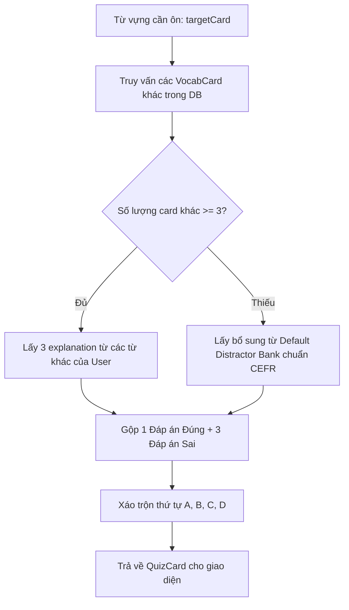

# Technical Design Spec: Spaced Repetition System (SRS) for Vocabulary Learning (Phase 11)

> **Mã dự án:** AHA-MIND / Story Shadowing / Phase 11  
> **Tác giả:** Anh Tú & Antigravity  
> **Ngày phê duyệt:** 03/08/2026  
> **Trạng thái:** Sẵn sàng triển khai (Ready for Implementation)

---

## 1. Bối cảnh & Mục tiêu Sản phẩm (*Root Cause Analysis & Product Goal*)

### 1.1 Vấn đề cốt lõi (*Root Cause Analysis*)
- **Đường cong lãng quên Ebbinghaus (Forgetting Curve)**: Trong quá trình luyện phát âm (*Story Shadowing*), người học tiếp xúc với hàng loạt từ vựng (Vocabulary, Collocations, Phrasal Verbs) mới. Tuy nhiên, nếu không có cơ chế tái kích hoạt định kỳ, hơn **70% lượng từ vựng này sẽ bị quên lãng sau 48 giờ**.
- **Mục tiêu**: Xây dựng hệ thống **Spaced Repetition System (SRS)** tích hợp trực tiếp vào ứng dụng Mobile-First PWA, cho phép người dùng chọn lọc lưu từ vựng từ các bài học và tham gia các phiên ôn tập trắc nghiệm hàng ngày (*Daily Quiz Review Session*) dựa trên thuật toán **FSRS (Free Spaced Repetition Scheduler)** để đưa từ vựng vào trí nhớ dài hạn (*Long-term Memory*).

---

## 2. Kiến trúc Tổng thể & Dữ liệu (*Architecture & Data Model*)

```mermaid
graph TD
    subgraph PlayerView["1. Thu thập Từ vựng"]
        PV[Player Page /step=vocab] -->|Bấm + Save| API_Save[POST /api/vocab]
    end

    subgraph Backend["2. Lưu trữ & Tính toán Lịch ôn"]
        API_Save --> DB_Vocab[(MongoDB: vocab_cards)]
        FSRS_Engine[ts-fsrs Scheduler Engine] <--> API_Review[POST /api/vocab/review]
        API_Review --> DB_Vocab
        API_Review --> DB_Log[(MongoDB: vocab_review_logs)]
    end

    subgraph UserExperience["3. Nhắc nhở & Ôn tập (Quiz)"]
        DB_Vocab -->|Query due <= now| API_Due[GET /api/vocab/due-count]
        API_Due --> Tab_Badge[Tab Vocab Badge: • 12]
        API_Due --> Dash_Card[Dashboard: Bạn có 12 từ cần ôn]
        Dash_Card & Tab_Badge --> Quiz_View[/vocab/review - Quiz Session]
        Quiz_View -->|4 lựa chọn tiếng Anh| API_Review
    end
```

---

### 2.1 MongoDB Data Models

#### Collection `vocab_cards` (Model: `VocabCard`)
Lưu trữ thông tin từ vựng độc lập kèm trạng thái chu kỳ FSRS:

```typescript
// src/lib/db/models/VocabCard.ts
import mongoose, { Schema, Document, Types } from "mongoose";

export interface IVocabCard extends Document {
  // === Nội dung từ vựng ===
  word: string;
  ipa?: string;
  explanation: string;              // 100% tiếng Anh
  level: "A1" | "A2" | "B1" | "B2" | "C1" | "C2";
  wordFamily?: { word: string; partOfSpeech?: string; ipa?: string; explanation: string }[];
  collocations?: { collocation: string; explanation: string }[];

  // === Nguồn gốc bài học ===
  sourceStorybookId: Types.ObjectId;
  sourceStorybookTitle: string;

  // === Trạng thái thuật toán FSRS (ts-fsrs) ===
  fsrs: {
    due: Date;                      // Thời điểm cần ôn tập tiếp theo
    stability: number;              // Độ ổn định ký ức (S)
    difficulty: number;             // Độ khó của từ đối với cá nhân (D)
    elapsed_days: number;           // Số ngày kể từ lần ôn trước
    scheduled_days: number;         // Khoảng cách ngày đã lên lịch
    reps: number;                   // Tổng số lượt ôn
    lapses: number;                 // Số lần trả lời sai
    state: 0 | 1 | 2 | 3;           // 0: New, 1: Learning, 2: Review, 3: Relearning
    last_review?: Date;             // Lần ôn gần nhất
  };

  createdAt: Date;
  updatedAt: Date;
}
```

#### Collection `vocab_review_logs` (Model: `VocabReviewLog`)
Lưu vết từng lần làm Quiz để hỗ trợ tính toán và hiển thị thống kê:

```typescript
// src/lib/db/models/VocabReviewLog.ts
export interface IVocabReviewLog extends Document {
  vocabCardId: Types.ObjectId;
  word: string;
  rating: 1 | 2 | 3 | 4;          // 1: Again, 2: Hard, 3: Good, 4: Easy
  state: number;
  due: Date;
  stability: number;
  difficulty: number;
  elapsed_days: number;
  scheduled_days: number;
  responseTimeMs: number;
  reviewedAt: Date;
}
```

---

## 3. FSRS Engine & Mapping Quy tắc Quiz (*FSRS Algorithm & Rating Engine*)

### 3.1 Cấu hình Engine `ts-fsrs`

```typescript
// src/lib/srs/fsrs.ts
import { fsrs, generatorParameters, Rating, State } from "ts-fsrs";

export const srsScheduler = fsrs(
  generatorParameters({
    request_retention: 0.9,       // Tối ưu để nhớ 90% từ vựng
    maximum_interval: 365,        // Giới hạn chu kỳ tối đa 365 ngày
    enable_fuzz: true,            // Phân tán lịch tránh dồn lịch 1 ngày
  })
);
```

### 3.2 Quy tắc Mapping: Kết quả Quiz (100% English) $\rightarrow$ FSRS Rating

Do sử dụng phương pháp **Quiz 4 lựa chọn khách quan**, rating FSRS được tính toán kết hợp giữa **tính đúng/sai** và **thời gian phản hồi (Retrieval Latency)**:

| Kết quả Quiz | Thời gian phản hồi | FSRS Rating | Ý nghĩa hành vi & Xử lý FSRS |
| :--- | :--- | :---: | :--- |
| ❌ **Sai** | Bất kỳ | **`Rating.Again` (1)** | Quên từ $\rightarrow$ Reset về trạng thái `Relearning`, ôn lại ngay trong phiên |
| ✅ **Đúng** | $> 10$ giây | **`Rating.Hard` (2)** | Nhớ nhưng do dự $\rightarrow$ Tăng interval nhẹ |
| ✅ **Đúng** | $3 - 10$ giây | **`Rating.Good` (3)** | Nhớ tốt với nhịp độ chuẩn $\rightarrow$ Tăng interval theo chuẩn FSRS |
| ✅ **Đúng** | $< 3$ giây | **`Rating.Easy` (4)** | Phản xạ tức thì $\rightarrow$ Tăng interval vượt bậc |

---

## 4. Chiến lược Sinh Đáp Án Nhiễu (*Distractor Generation Strategy*)

Tất cả các đáp án trắc nghiệm **100% bằng tiếng Anh**:



---

## 5. Danh mục API Routes Chi tiết (*API Specifications*)

| Method | Route | Chức năng | Request Payload | Response Body |
| :--- | :--- | :--- | :--- | :--- |
| `POST` | `/api/vocab` | Lưu từ vựng vào SRS | `{ word, ipa?, explanation, level, wordFamily?, collocations?, sourceStorybookId, sourceStorybookTitle }` | `{ success: true, id: string, created: boolean }` |
| `GET` | `/api/vocab/due-count` | Lấy số lượng từ cần ôn hôm nay | — | `{ dueCount: number, totalSaved: number, newCount: number }` |
| `GET` | `/api/vocab/review-session` | Tạo phiên Quiz (tối đa 15–20 từ) | `?limit=15` | `{ sessionCards: QuizQuestion[] }` |
| `POST` | `/api/vocab/review` | Ghi nhận câu trả lời Quiz | `{ cardId: string, isCorrect: boolean, responseTimeMs: number }` | `{ rating: number, nextDue: string, correct: boolean }` |
| `GET` | `/api/vocab` | Lấy danh sách toàn bộ từ đã lưu | `?search=&level=&sort=` | `{ cards: IVocabCard[], total: number }` |
| `DELETE` | `/api/vocab/[id]` | Xoá từ khỏi danh mục SRS | `id` in URL | `{ success: true }` |

---

## 6. Giao diện Người dùng & Luồng Tương tác (*UI/UX Specifications*)

### 6.1 Tích hợp nút "+ Save" trong Player ([/apps/story-shadowing/player/:id](file:///Users/anhtus/Documents/Development/NextJS/aha-tools/src/app/apps/story-shadowing/player/[id]/page.tsx))
- Trong `step === "vocab"` (trước khi vào bài Shadowing), mỗi thẻ `VocabCard` bổ sung nút:
  - Trạng thái chưa lưu: Nút `+ Lưu vào SRS` (viền mỏng, icon bookmark).
  - Trạng thái đã lưu: Đổi thành `✓ Đã lưu` (màu xanh emerald hoặc amber dịu, disabled).

### 6.2 Nhắc nhở thông minh trên Dashboard & Navigation
- **MobileTabBar** ([mobile-tab-bar.tsx](file:///Users/anhtus/Documents/Development/NextJS/aha-tools/src/components/mobile-shell/mobile-tab-bar.tsx)): Thẻ **Vocab** tự động hiển thị chấm số badge đỏ/cam khi `dueCount > 0`.
- **Home Dashboard** ([page.tsx](file:///Users/anhtus/Documents/Development/NextJS/aha-tools/src/app/page.tsx)): Thêm component `DueReviewCard` nổi bật: *"🔥 Bạn có X từ vựng cần kích hoạt trí nhớ hôm nay"* kèm nút CTA *"Bắt đầu ôn tập"*.

### 6.3 Màn hình Tab Vocab Chính ([/vocab/page.tsx](file:///Users/anhtus/Documents/Development/NextJS/aha-tools/src/app/vocab/page.tsx))
- **Stats Header**: 4 chỉ số ngắn gọn (Tổng số từ, Cần ôn hôm nay, Đang học, Đã nhớ lâu).
- **Banner CTA Ôn tập**: Nhấn vào mở ngay màn hình Quiz `/vocab/review`.
- **Vocabulary Explorer List**: Danh sách từ đã lưu, có thanh tìm kiếm nhanh, tag lọc theo Level (B1/B2/C1), và hiển thị ngày ôn tiếp theo.

### 6.4 Màn hình Quiz Ôn tập Độc lập ([/vocab/review/page.tsx](file:///Users/anhtus/Documents/Development/NextJS/aha-tools/src/app/vocab/review/page.tsx))
- Tự động **Ẩn Tab Bar** để tập trung 100% không gian cho bài Quiz.
- **Top Bar**: Thanh tiến độ (ví dụ `5 / 15`) + Nút thoát nhanh về trang chủ.
- **Word Hero Box**: Hiển thị từ vựng dạng chữ lớn, phiên âm IPA, nút loa 🔊 nghe phát âm.
- **4 Answer Cards (A, B, C, D)**: 4 lựa chọn định nghĩa tiếng Anh. Khi người dùng chạm:
  - Đáp án đúng nhấp nháy xanh lá ✅.
  - Nếu chọn sai: Đáp án chọn chuyển đỏ ❌ và highlight đáp án đúng.
  - Hiển thị phần giải thích tóm tắt & nút *"Tiếp theo ▶"*.
- **Summary Screen**: Sau khi hết 15 câu, hiển thị màn hình tổng kết: Tỷ lệ đúng %, Số từ đã kích hoạt trí nhớ, Streak ngày học.

---

## 7. Kế hoạch Kiểm thử & Xác minh (*Verification Plan*)

1. **Unit Test FSRS Math & State Flow**:
   - Kiểm tra tính toán `fsrs.next()` với các rating (Again, Hard, Good, Easy) tạo ra `due` date tăng dần chính xác.
2. **Kiểm thử API Endpoint**:
   - Lưu từ mới $\rightarrow$ Kiểm tra không bị duplicate.
   - Gọi `GET /api/vocab/review-session` $\rightarrow$ Đảm bảo mỗi câu luôn có đủ 4 lựa chọn tiếng Anh độc nhất.
3. **Kiểm thử Giao diện PWA & Build Check**:
   - Chạy `pnpm build` để xác thực 100% type safety và route compilation.
   - Thử nghiệm trên Safari/Chrome mobile viewport đảm bảo layout 480px và safe-area hoàn mỹ.

---

*Made by Anh Tu - Share to be share*
